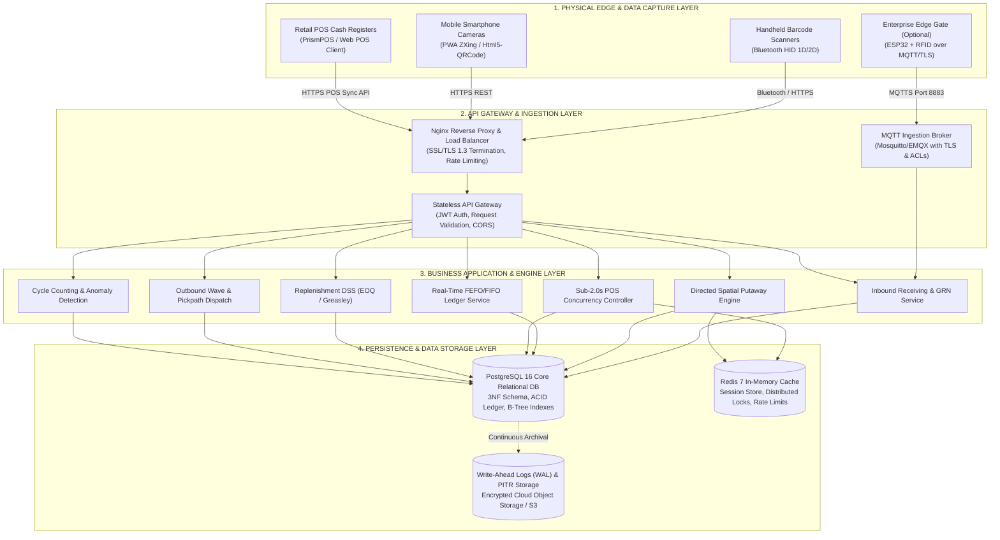
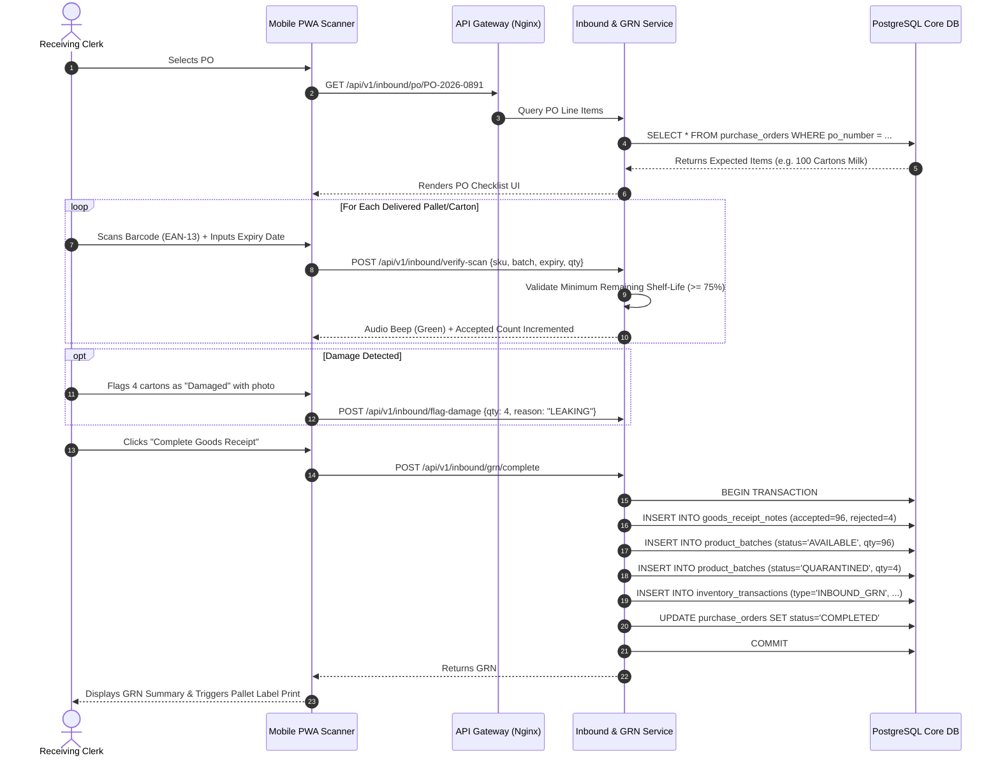
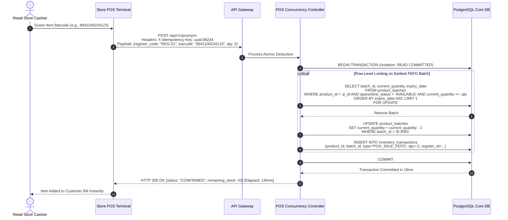
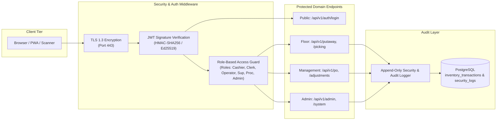
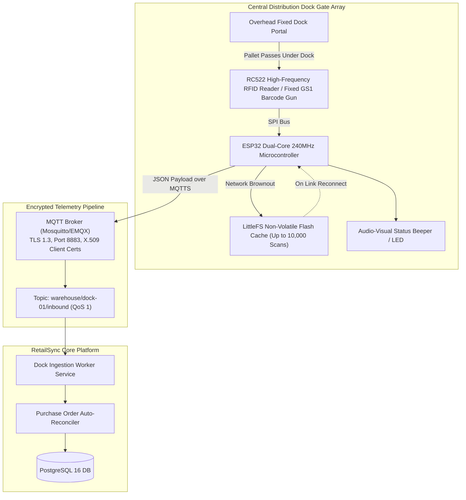

# Software Architecture Document (SAD)

## RetailSync: Centralized Super Shop Warehouse Management System
**Subtitle:** Technical Architecture, Component Decomposition, Concurrency Isolation, and Data Flow Design  
**Course:** SE-231 (Software System Analysis & Design / Capstone Project 2)  
**Academic Institution:** Daffodil International University (DIU), Department of Software Engineering  
**Author:** Raisul Islam Likhon (Section: SWE-44D)  
**Date:** September 2026 | Version: 1.0.0-RELEASE  

---

## 1. Architectural Principles & System Goals

RetailSync is engineered as a **decoupled, multi-tier cyber-physical software platform** optimized for transactional reliability, sub-second latency, and rigorous data consistency:

* **ACID-First Relational Ledger:** Financial transactions and stock balance state transitions are non-negotiable. Every stock movement is logged in an append-only double-entry ledger within strict database transaction boundaries.
* **Sub-2.0s Concurrency Guarantee:** Retail POS checkout counters must never wait on warehouse database contention. High-throughput row-level locking (`SELECT ... FOR UPDATE`) guarantees zero deadlocks and zero phantom over-selling.
* **Decoupled Stateless Services:** Backend business domain services remain stateless, containerized via Docker, allowing horizontal scaling behind reverse proxies and connection poolers.
* **Offline-Tolerant Client Edges:** Network outages in steel-reinforced warehouse racking or retail branches are mitigated via client-side Service Workers and encrypted IndexedDB queues with idempotent sync replay.
* **Defense-in-Depth Security:** End-to-end TLS 1.3 encryption, Argon2id password hashing, JWT stateless access tokens with rotated refresh tokens, and immutable audit logs.
* **Hybrid Enterprise Edge Extensibility:** Native architectural adapters allow plugging in automated stationary dock gate scanners (ESP32 MCU + RFID / fixed industrial scanners) for bulk pallet intake.

---

## 2. High-Level 4-Tier System Architecture



---

## 3. Component & Service Decomposition

### 3.1 Service Catalog & Responsibilities

| Service Identifier | Technology & Framework | Primary Architectural Responsibilities | Inter-Service Communication |
| :--- | :--- | :--- | :--- |
| **Auth & Security Service** | Node.js (TypeScript) / Python FastAPI | JWT token generation, refresh token rotation, Argon2id password hashing, RBAC permission evaluation. | Synchronous REST / Internal Middleware |
| **Product Master Service** | Python FastAPI / Pydantic v2 | Master SKU catalog, EAN-13 barcode validation, ABC turnover classification, temperature requirements. | Synchronous REST, Redis Cache |
| **Inbound & GRN Service** | Python FastAPI / SQLAlchemy 2.0 | Purchase Order matching, carton scan verification, damage quarantine segregation, digital GRN generation. | REST / PostgreSQL Transactions |
| **Spatial Putaway Engine** | Python FastAPI / NetworkX | Dynamic Zone-Aisle-Rack-Shelf-Bin mapping, volumetric/weight capacity evaluation, velocity-based bin recommendations. | REST / Redis Spatial Cache |
| **FEFO Inventory Ledger** | PostgreSQL 16 Stored Triggers / Python | Append-only transaction logging, batch expiry monitoring, FEFO priority queue sorting, automated quarantine locks. | ACID PostgreSQL Database Engine |
| **POS Concurrency Controller** | Python FastAPI / asyncpg | High-speed checkout deduction, row-level locking (`SELECT ... FOR UPDATE`), idempotency token validation. | Direct PostgreSQL connection pool |
| **Replenishment DSS Engine** | Python / NumPy / SciPy | Continuous calculation of EOQ, Greasley's Statistical Safety Stock, dynamic ROP alerting, automated draft PO creation. | Background Celery Worker / Cron |
| **Outbound Wave Dispatch** | Python FastAPI | Branch requisition consolidation, wave picking batching, shortest-path aisle routing (TSP heuristic), dispatch chalans. | REST / PostgreSQL Transactions |
| **Audit & Anomaly Service** | Python / Scikit-learn | Immutable audit logging, cycle count blind entry reconciliation, Isolation Forest machine learning for shrinkage detection. | Asynchronous Celery Tasks |

---

## 4. End-to-End Sequence Diagrams

### 4.1 Sequence 1: Inbound Receiving & Digital GRN Generation



### 4.2 Sequence 2: Sub-2.0s POS Checkout Atomic Stock Deduction



---

## 5. Concurrency Control & Transaction Isolation Architecture

### 5.1 The Concurrency Challenge in Super Shop Retail
During festival rush periods (such as Ramadan afternoon grocery shopping), multiple cash registers across branches and warehouse pickers simultaneously query and decrement stock balances. Naive optimistic locking (`UPDATE ... WHERE version = x`) results in widespread transaction rollback errors on high-velocity items, frustrating cashiers and stalling checkout queues.

### 5.2 Pessimistic Row-Level Locking Architecture (`SELECT ... FOR UPDATE`)
RetailSync enforces **Pessimistic Row-Level Locking** specifically at the batch row level inside an atomic transaction:

```sql
-- RetailSync Atomic Deduction Stored Procedure / Query Pattern
BEGIN;

-- 1. Identify and lock exclusively the earliest active FEFO batch with adequate stock
SELECT batch_id, current_quantity 
FROM product_batches
WHERE product_id = $1 
  AND quarantine_status = 'AVAILABLE' 
  AND current_quantity >= $2
ORDER BY expiry_date ASC 
LIMIT 1 
FOR UPDATE;

-- 2. Decrement physical stock
UPDATE product_batches
SET current_quantity = current_quantity - $2
WHERE batch_id = $selected_batch_id;

-- 3. Append immutable transaction audit record
INSERT INTO inventory_transactions (
    product_id, batch_id, location_id, transaction_type, quantity, reference_document_no, user_id
) VALUES (
    $1, $selected_batch_id, $location_id, 'POS_SALE_FEFO', -$2, $receipt_no, $user_id
);

COMMIT;
```

### 5.3 Deadlock Elimination Strategy
1. **Deterministic Lock Ordering:** If a composite transaction deducts multiple SKUs (e.g., shopping cart checkout), the application layer strictly sorts all requested SKU IDs in ascending numerical order before acquiring database locks (`ORDER BY product_id ASC`).
2. **Short Transaction Life:** Business logic validation (price calculation, customer loyalty) executes *prior* to opening the database transaction. Database transactions remain open for less than **25 milliseconds**.
3. **Connection Pooling Tuning:** PgBouncer maintains dedicated transaction-mode pools ensuring high throughput without exhausting database worker threads.

---

## 6. Offline-First Resilience & Network Outage Architecture

```mermaid
graph TD
    subgraph ClientEdge["Retail Branch POS / Mobile Scanner Edge"]
        UI["React / PWA UI Layer"]
        SW["Service Worker (Cache Storage)"]
        IDB[("Encrypted IndexedDB<br/>Offline Transactions Queue")]
        SyncManager["Background Sync Manager"]
    end

    subgraph Network["Connectivity Layer"]
        ISP["Internet Link (Fiber / 4G)"]
    end

    subgraph CentralServer["RetailSync Central Cloud Server"]
        API["Idempotent POS Ingestion API"]
        IdemCache[("Redis Idempotency Cache<br/>(Key: X-Idempotency-Key)")]
        CoreDB[("PostgreSQL ACID Core")]
    end

    UI -->|1. Scan Item| SW
    SW -->|2. Check Connectivity| ISP
    ISP -.->|3a. Connection Failed / Drop| IDB
    SW -->|3b. Buffer Transaction| IDB
    UI -->|Visual Amber Badge| UI

    SyncManager -->|4. Detects Link Recovery| IDB
    SyncManager -->|5. Bulk Replay with Idempotency Tokens| ISP
    ISP -->|POST /api/v1/pos/bulk-sync| API
    API -->|6. Check Key Exists?| IdemCache
    IdemCache -->|New Key| CoreDB
    CoreDB -->|7. Commit Batch| API
    API -->>|HTTP 200 Success| SyncManager
    SyncManager -->|8. Clear Buffered Queue| IDB
```

### 6.1 Idempotency Guarantee
Every offline transaction generates a unique UUIDv4 token passed via the HTTP header:  
`X-Idempotency-Key: e4b2d184-7832-4e92-9844-329810a911ab`  
When bulk-sync replays, Redis verifies whether the idempotency key was previously processed within a 48-hour TTL, completely eliminating duplicate stock deductions even if network retries occur multiple times.

---

## 7. Security, RBAC & Audit Architecture



### 7.1 Database Permission Hardening
At the database engine level, the application database user role (`retailsync_app`) is granted `INSERT` and `SELECT` privileges on `inventory_transactions`, but is strictly revoked of `UPDATE` and `DELETE` permissions:
```sql
REVOKE UPDATE, DELETE ON inventory_transactions FROM retailsync_app;
-- Guaranteed immutable audit ledger by engine constraints
```

---

## 8. Hybrid Enterprise Edge Gateway (WarePulse IoT Integration)

For high-throughput central distribution warehouses receiving 50+ pallet deliveries daily, RetailSync integrates the **WarePulse IoT Edge Gateway** as an optional high-speed automated dock intake portal:



* **Zero-Touch Inbound Registration:** Pallets pass through loading dock portals; tags are read hands-free within 150 ms; draft GRNs are created automatically in RetailSync with zero manual data entry.
