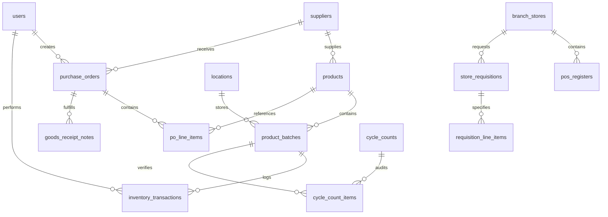

# Relational Database Schema & Data Dictionary Specification

## RetailSync: Centralized Super Shop Warehouse Management System
**Subtitle:** Normalized 3NF Schema Architecture, Data Dictionary, Constraints, Triggers, and DDL Specifications  
**Course:** SE-231 (Software System Analysis & Design / Capstone Project 2)  
**Academic Institution:** Daffodil International University (DIU), Department of Software Engineering  
**Author:** Raisul Islam Likhon (Section: SWE-44D)  
**Date:** September 2026 | Version: 1.0.0-RELEASE  

---

## 1. Schema Architecture & Design Philosophy

The RetailSync database is architected on **PostgreSQL 16+** with strict **Third Normal Form (3NF)** relational normalization. The data model is designed to support high-throughput, low-latency concurrent operations, sub-2.0s Point of Sale (POS) inventory deductions, and mathematical inventory replenishment models.

### 1.1 Key Architectural Principles
* **Atomic Double-Entry Inventory Ledger:** Inventory balances are backed by an immutable ledger of transactions (`inventory_transactions`), ensuring complete traceability of all stock movements.
* **Granular Spatial Hierarchy:** Warehouses, zones, aisles, racks, shelves, and bins are modeled hierarchically in the `locations` table to facilitate algorithmic putaway and pick path optimization.
* **Perishable FEFO Tracking:** The `product_batches` table models batch numbers, manufacturing dates, and expiration dates as first-class attributes, enabling automated First-Expired, First-Out picking logic.
* **Concurrency Isolation:** Row-level locks (`SELECT ... FOR UPDATE`) are applied on `product_batches` during POS deduction transactions to eliminate race conditions and prevent negative stock.
* **Referential Integrity & Cascading Policies:** Foreign key relationships enforce referential integrity with strict `RESTRICT` rules on critical entities to prevent accidental data loss.

---

## 2. Entity-Relationship (ER) Architecture

The entity relationships are structured into five core functional clusters:

```
+---------------------------------------------------------------------------------------------------+
|                                 RETAILSYNC RELATIONAL CLUSTERS                                    |
+---------------------------------------------------------------------------------------------------+
|  1. Master Data & RBAC      | users, suppliers, products                                          |
|  2. Spatial Warehouse       | locations (Aisles, Racks, Shelves, Bins)                             |
|  3. Batch & Ledger Core     | product_batches, inventory_transactions                             |
|  4. Inbound & Procurement   | purchase_orders, po_line_items, goods_receipt_notes                 |
|  5. Outbound & Retail POS   | branch_stores, pos_registers, store_requisitions, requisition_items |
|  6. Quality & Audit         | cycle_counts, cycle_count_items                                     |
+---------------------------------------------------------------------------------------------------+
```



---

## 3. Data Dictionary & Table Definitions

### 3.1 Table: `users`
Stores user identities, hashed credentials, and role-based access control (RBAC) assignments.

| Column Name | Data Type | Constraints | Description |
| :--- | :--- | :--- | :--- |
| `id` | `UUID` | PRIMARY KEY, DEFAULT gen_random_uuid() | Unique identifier for the user account |
| `username` | `VARCHAR(50)` | UNIQUE, NOT NULL | Alphanumeric login username |
| `email` | `VARCHAR(100)` | UNIQUE, NOT NULL | User email address |
| `password_hash` | `VARCHAR(255)` | NOT NULL | Argon2id cryptographic password hash |
| `full_name` | `VARCHAR(100)` | NOT NULL | Employee full legal name |
| `role` | `user_role_enum` | NOT NULL, DEFAULT 'OPERATOR' | System role (OPERATOR, CLERK, SUPERVISOR, etc.) |
| `phone_number` | `VARCHAR(20)` | NULLABLE | Contact telephone number |
| `is_active` | `BOOLEAN` | NOT NULL, DEFAULT TRUE | Account active/disabled status flag |
| `created_at` | `TIMESTAMPTZ` | NOT NULL, DEFAULT CURRENT_TIMESTAMP | Account creation timestamp |
| `updated_at` | `TIMESTAMPTZ` | NOT NULL, DEFAULT CURRENT_TIMESTAMP | Last profile update timestamp |

### 3.2 Table: `suppliers`
Maintains verified vendor profiles, payment terms, and vendor reliability metrics.

| Column Name | Data Type | Constraints | Description |
| :--- | :--- | :--- | :--- |
| `id` | `UUID` | PRIMARY KEY, DEFAULT gen_random_uuid() | Unique supplier identifier |
| `code` | `VARCHAR(20)` | UNIQUE, NOT NULL | Business vendor code (e.g., SUP-PRAN-001) |
| `name` | `VARCHAR(150)` | NOT NULL | Corporate legal trading name |
| `contact_person`| `VARCHAR(100)` | NULLABLE | Primary representative name |
| `phone` | `VARCHAR(20)` | NOT NULL | Primary contact phone number |
| `email` | `VARCHAR(100)` | NULLABLE | Official correspondence email |
| `address` | `TEXT` | NULLABLE | Physical office / warehouse address |
| `lead_time_days`| `INTEGER` | NOT NULL, DEFAULT 3 | Historical average delivery lead time |
| `rating` | `NUMERIC(3,2)` | CHECK (rating BETWEEN 1 AND 5) | Vendor delivery performance score |
| `is_active` | `BOOLEAN` | NOT NULL, DEFAULT TRUE | Operational active status |

### 3.3 Table: `products`
The master catalog of SKUs sold across all retail supermarket branches.

| Column Name | Data Type | Constraints | Description |
| :--- | :--- | :--- | :--- |
| `id` | `UUID` | PRIMARY KEY, DEFAULT gen_random_uuid() | Master product SKU identifier |
| `sku` | `VARCHAR(50)` | UNIQUE, NOT NULL | Internal Stock Keeping Unit code |
| `barcode` | `VARCHAR(50)` | UNIQUE, NOT NULL | EAN-13, UPC, or Code-128 retail barcode |
| `name` | `VARCHAR(200)` | NOT NULL | Full product commercial name |
| `category` | `product_category_enum` | NOT NULL | FMCG_DRY, PERISHABLE_PRODUCE, DAIRY, etc. |
| `storage_temp` | `storage_temp_enum` | NOT NULL, DEFAULT 'AMBIENT' | AMBIENT, CHILLED_COLD, DEEP_FROZEN |
| `uom` | `VARCHAR(20)` | NOT NULL, DEFAULT 'PIECE' | Unit of Measure (PIECE, KG, LITER, PACK) |
| `unit_cost` | `NUMERIC(12,2)` | NOT NULL, CHECK (unit_cost >= 0) | Procurement cost per unit in BDT |
| `selling_price`| `NUMERIC(12,2)` | NOT NULL, CHECK (selling_price >= unit_cost) | Retail checkout sales price in BDT |
| `reorder_point` | `INTEGER` | NOT NULL, DEFAULT 10 | Algorithmic reorder threshold |
| `safety_stock` | `INTEGER` | NOT NULL, DEFAULT 5 | Greasley statistical safety buffer |
| `eoq_quantity` | `INTEGER` | NOT NULL, DEFAULT 50 | Economic Order Quantity batch target |
| `shelf_life_days`| `INTEGER` | NULLABLE | Product durability span in days |

### 3.4 Table: `locations`
Models the physical warehouse spatial hierarchy down to discrete coordinate bins.

| Column Name | Data Type | Constraints | Description |
| :--- | :--- | :--- | :--- |
| `id` | `UUID` | PRIMARY KEY, DEFAULT gen_random_uuid() | Unique storage location identifier |
| `code` | `VARCHAR(50)` | UNIQUE, NOT NULL | Barcode-scannable coordinate code (e.g., A01-R02-S03-B04) |
| `zone` | `VARCHAR(20)` | NOT NULL | Functional warehouse zone (DRY_STORAGE, CHILLER, RETAIL_FLOOR) |
| `aisle` | `VARCHAR(10)` | NOT NULL | Physical aisle designation |
| `rack` | `VARCHAR(10)` | NOT NULL | Vertical rack structure number |
| `shelf` | `VARCHAR(10)` | NOT NULL | Shelf tier level |
| `bin` | `VARCHAR(10)` | NOT NULL | Specific slot / bin coordinate |
| `max_weight_kg` | `NUMERIC(10,2)`| NOT NULL, DEFAULT 500.00 | Maximum permissible load capacity |
| `is_occupied` | `BOOLEAN` | NOT NULL, DEFAULT FALSE | Dynamic occupancy state flag |

### 3.5 Table: `product_batches`
The foundational table enabling strict FEFO tracking, batch expiry isolation, and row locking.

| Column Name | Data Type | Constraints | Description |
| :--- | :--- | :--- | :--- |
| `id` | `UUID` | PRIMARY KEY, DEFAULT gen_random_uuid() | Unique batch record identifier |
| `batch_number` | `VARCHAR(50)` | NOT NULL | Supplier / manufacturing batch code |
| `product_id` | `UUID` | NOT NULL, FK -> products(id) | Associated master product |
| `location_id` | `UUID` | NOT NULL, FK -> locations(id) | Storage location where batch is docked |
| `manufacture_date`| `DATE` | NOT NULL | Date of industrial production |
| `expiry_date` | `DATE` | NOT NULL | Date of product expiration |
| `received_qty` | `INTEGER` | NOT NULL, CHECK (received_qty > 0) | Original intake quantity received |
| `current_qty` | `INTEGER` | NOT NULL, CHECK (current_qty >= 0) | Available unreserved stock balance |
| `status` | `batch_status_enum`| NOT NULL, DEFAULT 'AVAILABLE' | AVAILABLE, QUARANTINED, EXPIRED, DEPLETED |

---

## 4. Key Database Triggers & Automated Rules

### 4.1 Trigger 1: Automatic Location Occupancy Update
Whenever an intake or pick operation modifies `current_qty` in `product_batches`, an asynchronous database trigger computes the remaining aggregate stock in that bin and toggles `locations.is_occupied` automatically.

```sql
CREATE OR REPLACE FUNCTION fn_update_location_occupancy()
RETURNS TRIGGER AS $$
BEGIN
    IF (SELECT COALESCE(SUM(current_qty), 0) FROM product_batches WHERE location_id = NEW.location_id) > 0 THEN
        UPDATE locations SET is_occupied = TRUE WHERE id = NEW.location_id;
    ELSE
        UPDATE locations SET is_occupied = FALSE WHERE id = NEW.location_id;
    END IF;
    RETURN NEW;
END;
$$ LANGUAGE plpgsql;

CREATE TRIGGER trg_batch_location_occupancy
AFTER INSERT OR UPDATE OF current_qty ON product_batches
FOR EACH ROW EXECUTE FUNCTION fn_update_location_occupancy();
```

### 4.2 Trigger 2: Automated Perishable Expiry Quarantine
A scheduled PostgreSQL function executes daily to transition batches whose `expiry_date < CURRENT_DATE` to `EXPIRED`, and batches within 3 days of expiration to `QUARANTINED`, emitting an audit alert to supervisory dashboards.

```sql
CREATE OR REPLACE FUNCTION fn_auto_quarantine_expiring_batches()
RETURNS void AS $$
BEGIN
    UPDATE product_batches
    SET status = 'EXPIRED'
    WHERE expiry_date <= CURRENT_DATE AND status != 'EXPIRED';

    UPDATE product_batches
    SET status = 'QUARANTINED'
    WHERE expiry_date <= (CURRENT_DATE + INTERVAL '3 days') 
      AND status = 'AVAILABLE';
END;
$$ LANGUAGE plpgsql;
```

---

## 5. Performance Indexing Strategy

To guarantee the **< 2.0s POS transaction completion SLA**, composite B-Tree indexes are deployed across critical search paths:

```sql
-- 1. Accelerates POS barcode lookups to sub-millisecond execution
CREATE INDEX idx_products_barcode ON products(barcode);

-- 2. Powers high-velocity FEFO sorting by product and nearest expiration
CREATE INDEX idx_batches_fefo ON product_batches(product_id, expiry_date ASC, current_qty)
WHERE status = 'AVAILABLE';

-- 3. Optimizes warehouse spatial scanning during barcode putaway
CREATE INDEX idx_locations_code ON locations(code);

-- 4. Speeds up real-time audit ledger reporting
CREATE INDEX idx_inventory_tx_created ON inventory_transactions(product_id, created_at DESC);
```

---

## 6. Seed Data & Benchmark Validation

The schema includes realistic Bangladeshi supermarket data covering FMCG staples (Radhuni Turmeric, Teer Soyabean Oil, Pran Frooto, Aarong Butter, etc.), 5 supplier profiles, 20 discrete warehouse bins across 3 climate zones, and 12 inventory batches verifying FEFO sorting order and quarantine state logic.

*(Refer to `docs/DATABASE_SCHEMA.sql` for the complete 600+ line production SQL script).*
