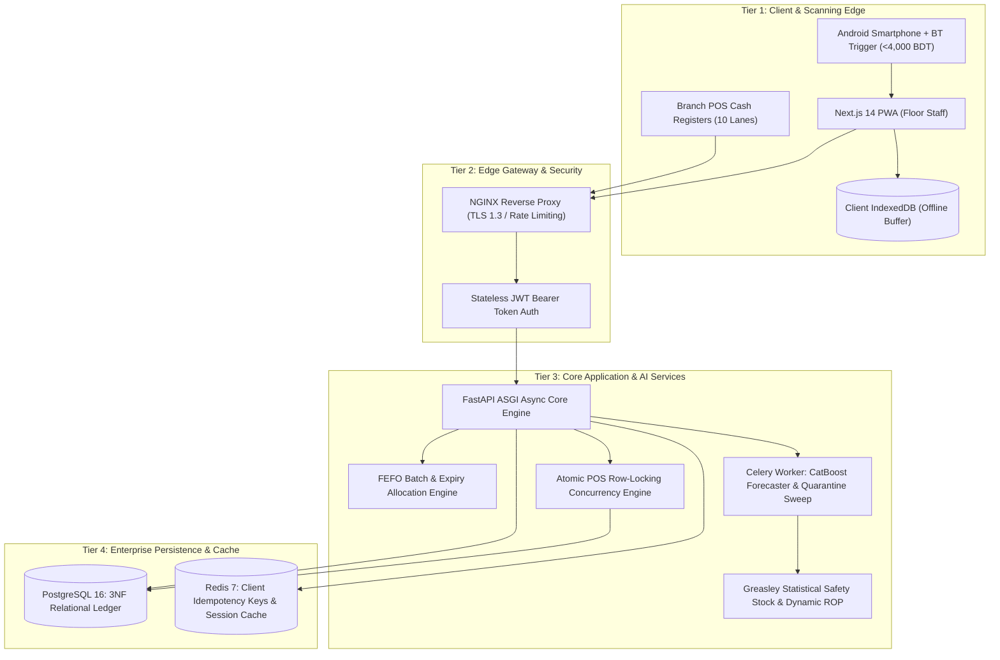
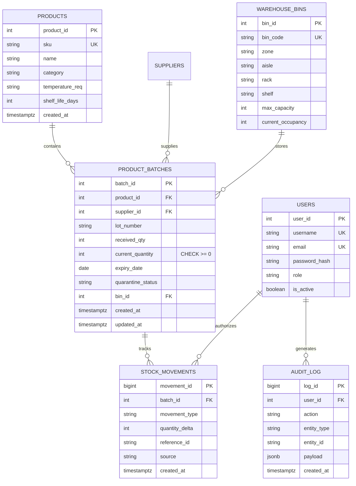
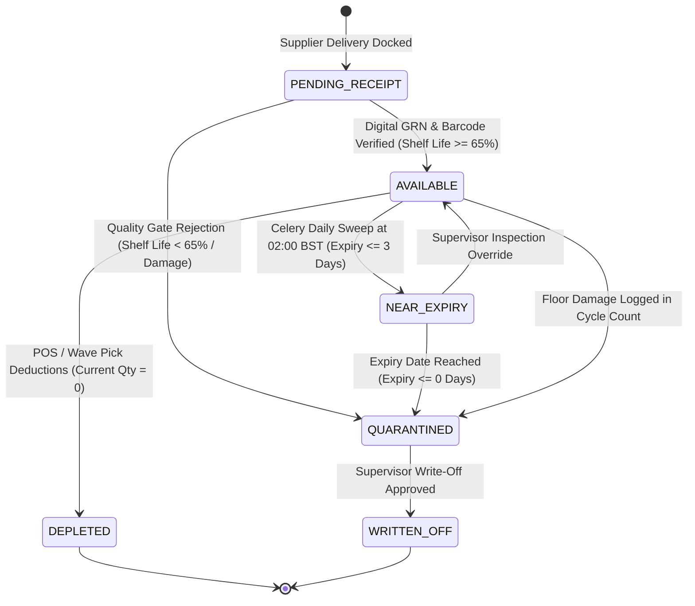

# RetailSync WMS — Master Project Context & Agent Handover Document
**Version:** 2.0.0-RELEASE (AI & Concurrency Upgraded)  
**Document Classification:** Comprehensive Engineering Handover & Architectural Ground Truth  
**Target Audience:** Autonomous AI Agents, Lead Software Architects, Capstone Defense Examiners  
**Last Updated:** September 28, 2026  

---

## 1. Executive Master Summary & Project Identity

### 1.1 Project Identification
- **System Name:** **RetailSync: Centralized Super Shop Warehouse Management System**
- **System Type:** Centralized, Multi-Branch Grocery & Supermarket WMS (Web, Mobile PWA, Cloud)
- **Academic Context:** Course **SE-231** (Software System Analysis & Design / Capstone Project 2)
- **Institution:** Department of Software Engineering, Faculty of Science and Information Technology, **Daffodil International University (DIU)**, Dhaka, Bangladesh
- **Section:** **SWE-44D** | Semester: **Fall 2026**
- **Project Team Attribution:**
  - **Raisul Islam Likhon** — Team Lead & Software Architect (Student ID: `251-35-508`)
  - **Shottobroto Dey** — Full-Stack Engineer & Database Designer (Student ID: `251-35-017`)
  - **Golam Husnain Papon** — Backend & AI/ML Engineer (Student ID: `251-35-529`)
- **Version Control Repository:** `https://github.com/Likhon545466/retailsync.git` (Branch: `main`)
- **Live Production Deployment URL:** `https://retailsync-two.vercel.app/`

### 1.2 Core Thesis & Problem Statement
In modern supermarket chains in Bangladesh (such as Shwapno, Agora, Meena Bazar, and Unimart), retail operations suffer from a fundamental disconnection between the front-of-house Point of Sale (POS) checkout counters and the back-of-house distribution warehouses. Transactions at the checkout do not atomically decrement warehouse batches in real time. This operational opacity results in three catastrophic profit leaks:

1. **Perishable Food & Dairy Spoilage (15% to 22% annual loss):** High-turnover goods (pasteurized milk, yogurt, poultry, packaged groceries) expire on rear warehouse shelves because stock is restocked naively rather than following strict First-Expired, First-Out (FEFO) picking.
2. **Phantom Inventory Shrinkage (1.8% to 2.4% annual write-offs):** Discrepancies between computer spreadsheets and physical shelf stock arise from unrecorded breakages, packaging tears, and manual tally errors.
3. **Peak-Hour Stockouts & POS Latency (7.5% to 11.2% lost retail revenue):** During festival rushes (Ramadan, Eid, Friday evenings), high-velocity grocery staples sell out in minutes because replenishment alerts lag by hours, while cash registers experience database locking.

RetailSync unifies warehouse receiving, directed spatial putaway, batch-level FEFO rotation, atomic POS deductions, and AI-driven predictive replenishment into a single real-time relational core.

---

## 2. 4-Tier Cyber-Physical System Architecture

RetailSync is implemented as a modern 4-tier architecture designed for horizontal scalability, sub-second latency, and extreme offline resilience:



### 2.1 Tier Breakdown & Specifications
- **Tier 1 (Client & Edge):**
  - Next.js 14 Progressive Web Application (PWA) with TypeScript and responsive CSS.
  - Client-side offline persistence via encrypted browser **IndexedDB** buffering $\ge$ 200 transactions.
  - Hardware: Standard consumer Android 13+ smartphones paired with **Bluetooth HID 1D/2D Barcode Trigger Grips** (< 4,000 BDT per unit), replacing 60,000 BDT industrial Zebra terminals.
- **Tier 2 (Gateway & Security):**
  - NGINX Reverse Proxy terminating TLS 1.3 with automated rate limiting (100 req/min per IP).
  - Stateless JWT token authorization with Argon2id password hashing and role-based access control.
- **Tier 3 (Application & AI Core):**
  - Python 3.11+ **FastAPI ASGI** high-performance asynchronous server.
  - Distributed **Celery** background worker pool backed by Redis.
  - **CatBoost Regressor** time-series forecasting engine with calendar festival embeddings.
  - Greasley Statistical Safety Stock and dynamic Reorder Point (ROP) Decision Support System (DSS).
- **Tier 4 (Persistence & Cache):**
  - **PostgreSQL 16** strictly normalized in Third Normal Form (3NF) with partial indexes and engine-level `CHECK` constraints.
  - **Redis 7.2+** for sub-millisecond session caching and distributed idempotency locking (`X-Idempotency-Key`).
  - Serverless SQLite fallback (`/tmp/retailsync.db`) for Vercel lambda execution.

---

## 3. The 11 Core Functional Modules (M-01 to M-11)

| Module ID & Name | Requirement Range | Operational Role & Capabilities | MoSCoW Priority |
| :--- | :---: | :--- | :---: |
| **M-01: Authentication, RBAC & Profile** | `FR-01 to FR-06` | JWT authentication, session expiration, and 6 RBAC roles: Cashier, Dock Clerk, Floor Operator, Supervisor, SCM Officer, Admin. | **Must Have** |
| **M-02: Product Master & Hierarchy** | `FR-07 to FR-13` | 500 FMCG SKUs, EAN-13/Code-128 barcode mapping, 4 thermal classes (Ambient, Chilled, Deep Frozen, Household), shelf-life rules. | **Must Have** |
| **M-03: Supplier & Purchase Orders** | `FR-14 to FR-20` | Supplier directory, lead-time variance tracking, digital PO generation, status lifecycle, approval hierarchy. | **Must Have** |
| **M-04: Inbound Receiving & Digital GRN** | `FR-21 to FR-28` | Dock receiving, barcode verification vs PO, strict 65% remaining shelf-life gate, damage logging, automated digital GRN generation. | **Must Have** |
| **M-05: Spatial Bin & Putaway Engine** | `FR-29 to FR-35` | 2D Zone-Aisle-Rack-Shelf-Bin coordinate mapping, volume capacity limits, directed putaway prompts factoring SKU ABC velocity and temperature class. | **Must Have** |
| **M-06: Real-Time Ledger & FEFO Engine** | `FR-36 to FR-44` | Double-entry stock ledger, batch/lot tracking, expiry tracking, FEFO priority deduction queue, automated quarantine locks. | **Must Have** |
| **M-07: Replenishment & Decision Support** | `FR-45 to FR-52` | Dynamic EOQ, Greasley Statistical Safety Stock ($Z=1.65$ to $2.33$), dynamic ROP alerts, CatBoost demand forecasting, automated draft POs. | **Must Have** |
| **M-08: Outbound Store Wave Picking** | `FR-53 to FR-60` | Multi-branch requisition consolidation, wave creation, shortest-path picking lists, pick verification scanning, dispatch staging. | **Must Have** |
| **M-09: Cycle Counting & Shrinkage Audit** | `FR-61 to FR-66` | ABC cycle counting schedules, blind physical count entry, rule-based discrepancy variance threshold (>3%), supervisor write-off approvals. | **Must Have** |
| **M-10: Reporting, Dashboards & Analytics** | `FR-67 to FR-72` | Real-time floor telemetry, stockout risk heatmaps, supplier SLA scorecards, inventory turnover & GMROI metrics, PDF/Excel export. | **Should Have** |
| **M-11: Security, Audit Trail & Compliance** | `FR-73 to FR-78` | Append-only immutable stock ledger, user attribution, Bangladesh Food Safety Act 2013 audit reports, PDPO 2025 privacy compliance. | **Must Have** |

---

## 4. Critical Engineering Decisions & Negative Guardrails (NON-NEGOTIABLE)

Any agent continuing development on RetailSync **MUST strictly obey** these foundational architectural rules:

### Rule 1: Non-Blocking FEFO Concurrency (`SKIP LOCKED`)
- **MANDATORY:** All POS checkout batch deduction queries **MUST** utilize `SELECT ... FOR UPDATE SKIP LOCKED` (not plain `FOR UPDATE`).
- **Rationale:** Under 10 concurrent cashier registers, plain `FOR UPDATE` creates sequential FIFO lock queues that compound latency and risk multi-item deadlock cycles. `SKIP LOCKED` causes competing transactions to immediately bypass locked batches and evaluate the next available batch, or immediately return `HTTP 409 Out of Stock` in < 10ms with zero deadlocks.

```sql
SELECT batch_id, current_quantity, expiry_date 
FROM product_batches 
WHERE product_id = :p_id 
  AND current_quantity >= :quantity 
  AND quarantine_status = 'AVAILABLE' 
ORDER BY expiry_date ASC 
LIMIT 1 
FOR UPDATE SKIP LOCKED;
```

### Rule 2: Client-Generated Idempotency Keys (`X-Idempotency-Key`)
- **MANDATORY:** Idempotency keys **MUST be generated client-side** inside the PWA client at the exact instant the transaction is created—**NEVER on the server at sync time**.
- **Key Format:** `{device_id}-{epoch_ms}-{local_sequence}` (e.g., `REG01-1790584900123-00042`).
- **Rationale:** During warehouse broadband cuts, transactions sit buffered in IndexedDB. If keys were server-generated, offline transactions would have no globally unique identity, causing double deductions if network drops during sync.

### Rule 3: Single MVP Machine Learning Model (CatBoost Only)
- **MANDATORY:** The MVP forecasting engine **MUST use CatBoost exclusively**. LightGBM is formally **deferred to post-capstone roadmap**.
- **Rationale:** Supermarket demand in Bangladesh is dominated by discrete calendar events (Ramadan, Eid-ul-Fitr, Eid-ul-Adha, Shab-e-Barat, Durga Puja, monthly salary cycles). CatBoost natively processes categorical features via ordered target statistics without manual one-hot encoding or target leakage. Attempting two ML architectures in a 14-week sprint causes scope collapse.

### Rule 4: Frugal Hardware (No ESP32, No MQTT Firmware)
- **MANDATORY:** Custom IoT firmware development (ESP32/MQTT) is **explicitly OUT OF SCOPE**.
- **Rationale:** Dock receiving is fully handled by consumer Android smartphones paired with Bluetooth HID trigger grips (< 4,000 BDT) running the PWA barcode scanner.

### Rule 5: Rule-Based Shrinkage Threshold Alert (No Isolation Forest in MVP)
- **MANDATORY:** Inventory shrinkage detection in Module M-09 **MUST use an empirical rule-based threshold alert**: flag if physical count variance $|Actual - Expected| / Expected > 0.03$ (3% threshold).
- **Rationale:** Unsupervised ML (Isolation Forest) requires months of labelled discrepancy training data that does not exist in a cold-start pilot. Isolation Forest is deferred to v2.0.

### Rule 6: Engine-Level Negative Stock Prevention
- **MANDATORY:** The `product_batches` table **MUST enforce** `CHECK (current_quantity >= 0)`.
- **Rationale:** Defense-in-depth against software bugs; database constraints reject negative balances even if application logic encounters a race condition.

---

## 5. Relational Schema & State Machine Architecture

### 5.1 3NF Entity Relationship Diagram (Figure 5)



### 5.2 Deterministic 6-State Batch Lifecycle State Machine



- **Daily Automated Sweep:** Celery worker executes daily at 02:00 BST. Batches $\le 3$ days to expiry transition to `NEAR_EXPIRY` for discount markdown. Batches $\le 0$ days are locked to `QUARANTINED`, preventing generation of pick lists and eliminating Food Safety Act violations.

---

## 6. AI Forecasting & Replenishment DSS (Module M-07)

Traditional static reorder formulas ($ROP = d \times L$) fail during grocery demand spikes. RetailSync pairs machine learning demand forecasting with Greasley's dual-variance safety stock model:

### 6.1 Greasley Statistical Safety Stock Formula
$$SS = Z \times \sqrt{(\overline{L} \times \sigma_d^2) + (\hat{d}_{i,t}^2 \times \sigma_L^2)}$$
Where:
- $Z$: Normal distribution service factor ($Z = 1.65$ for 95%, $Z = 2.33$ for 99%).
- $\overline{L}$: Mean supplier delivery lead time in days.
- $\sigma_d$: Historical standard deviation of daily SKU sales.
- $\hat{d}_{i,t}$: **CatBoost AI-forecasted daily demand** for SKU $i$ at forward horizon $t$.
- $\sigma_L$: Standard deviation of supplier lead-time delivery volatility.

### 6.2 Dynamic Reorder Point (ROP) & Economic Order Quantity (EOQ)
$$ROP = (\hat{d}_{i,t} \times \overline{L}) + SS$$
$$EOQ = \sqrt{\frac{2 \times AnnualDemand \times S}{H}}$$
- When live warehouse stock falls below $ROP$, the system automatically creates an approved draft Purchase Order 10 days before peak surges (e.g., Scenario D: Ramadan surge +340% oil demand).

---

## 7. UI/UX Design System: Clean Hybrid Architecture

The application has been transformed from an unusable dark/neon "cyberpunk" aesthetic to a clean, accessible enterprise design system:

### 7.1 Design Rationale
- **The Problem with Cyberpunk in Warehouses:** Supermarket back-office and cashier staff work 8-hour shifts under bright overhead fluorescent lighting. Low-contrast dark themes and neon glows cause severe eye strain, glare, and poor scannability.
- **The Solution (Option 3 Hybrid System):**
  1. **Clean Modern Enterprise SaaS (Stripe/Linear):** High-contrast light canvas (`#F8FAFC`), crisp white cards (`#FFFFFF`), 1px borders (`#E2E8F0`), deep navy typography (`#0F172A`), and royal blue primary buttons (`#2563EB`). Used for Dashboard, Inbound, Putaway, and Stock Ledger.
  2. **Shopify POS Touch Register:** Large tactile touch targets, high scannability, clear subtotal receipt pane, and an unmistakable emerald green checkout CTA (`#059669`). Used for `/pos`.
  3. **Architectural Blueprint Digital Twin:** Clean 2D floor blueprint with soft thermal zone badges (Ambient: soft emerald, Cold: sky blue, Frozen: soft purple, High-Value: warm amber). Used for `/warehouse`.

---

## 8. Financial Budget, CapEx & Payback Reconciliation

### 8.1 Capital Expenditure (CapEx) Itemized Breakdown
$$\text{Total Initial Capitalization} = \mathbf{485,000 \text{ BDT}}$$

| Budget Category | Amount (BDT) | Strategic Justification |
| :--- | :---: | :--- |
| **Hardware Terminals & Peripherals** | 34,050 | Android smartphone (12,500), 2x Bluetooth trigger grips (7,600), thermal printer (6,500), 3,000 adhesive labels (1,950), 6-month cloud staging VPS (5,500). |
| **Development & Engineering Labour** | 420,000 | 3-member engineering team × 14 weeks × standard software engineering stipend rate (~10,000 BDT/week/member). |
| **Contingency Reserve (5%)** | 22,700 | Dedicated buffer for hardware replacement, mobile 4G backup data packs, and peripheral spares during pilot operations. |
| **Regulatory & Compliance Documentation** | 8,250 | BSTI/BFSA audit documentation, printed pilot manuals, thermal roll refills, and domain/SSL certificates. |
| **Total Estimated Initial CapEx** | **485,000** | **Total initial capitalization required for 14-week delivery and pilot deployment.** |

### 8.2 Payback Period Arithmetic Proof
$$\text{Projected Payback Period} = \frac{\text{Total Initial CapEx}}{\text{Monthly Gross Savings} - \text{Monthly OpEx}} = \frac{485,000 \text{ BDT}}{187,200 \text{ BDT} - 14,000 \text{ BDT}} = \frac{485,000}{173,200} \approx \mathbf{2.80 \text{ Months}}$$

- **Perishable Spoilage Savings:** 112,000 BDT/month (reducing 22% waste to < 6%).
- **Phantom Shrinkage Savings:** 45,200 BDT/month (reducing 2.4% unrecorded loss to < 0.4%).
- **Peak Stockout Recovery:** 30,000 BDT/month (recovering lost evening and festival grocery sales).
- **Ongoing Monthly OpEx:** 14,000 BDT/month (staging VPS, thermal label rolls, 4G SIM backup, server maintenance).
- **Net Monthly Benefit:** $187,200 - 14,000 = \mathbf{173,200 \text{ BDT/month}}$.
- **Conclusion:** The initial investment is fully recouped in **2.80 months** of operational deployment.

---

## 9. 14-Week Agile Scrum Roadmap & 4 Validation Scenarios

### 9.1 Sprint Schedule (137 Story Points)
- **Sprint 1 (Weeks 1–2 / 21 pts):** PostgreSQL 3NF schema, migrations, and stateless JWT RBAC authentication.
- **Sprint 2 (Weeks 3–4 / 24 pts):** Inbound receiving, digital GRN generation, Bluetooth HID scanning, 65% shelf-life quality gate.
- **Sprint 3 (Weeks 5–6 / 26 pts):** Directed spatial putaway engine, real-time FEFO batch ledger, daily 02:00 BST quarantine Celery worker.
- **Sprint 4 (Weeks 7–8 / 22 pts):** High-concurrency POS checkout (`SKIP LOCKED`), client-generated idempotency keys, offline IndexedDB sync.
- **Sprint 5 (Weeks 9–10 / 23 pts):** CatBoost demand forecasting, Greasley dynamic safety stock, automated draft PO creation.
- **Sprint 6 (Weeks 11–12 / 21 pts):** Cycle counting with supervisor signoff, immutable audit trail, distributed Locust concurrency load tests.
- **Hardening (Weeks 13–14 / 0 pts):** Docker Compose packaging, user acceptance testing, capstone proposal defense rehearsal.

### 9.2 The 4 Stress-Injected Validation Scenarios
- **Scenario A: Inbound Dock Quality Gate (Sprint 2):** Supplier delivers 100 crates of pasteurized milk; 10 carry expiration dates with $\le 2$ days remaining (< 65% threshold). System rejects the 10 crates to `QUARANTINED`, accepts 90, and auto-generates a supplier credit note. Zero expired units enter active bins.
- **Scenario B: Rush-Hour POS Concurrency (Sprint 4):** 10 cashiers simultaneously ring up the final 5 remaining units of soybean oil at Friday 8:00 PM peak rush. Using `SELECT ... FOR UPDATE SKIP LOCKED`, the first 5 transactions deduct atomically; the remaining 5 immediately receive an out-of-stock response without lock queue deadlocks. p95 latency $\le 800$ms.
- **Scenario C: Network Blackout & Idempotent Replay (Sprint 4):** Central warehouse fiber severed; 50 checkout transactions occur offline in IndexedDB. Upon network recovery, client submits bulk sync with client-generated idempotency keys (`{device_id}-{epoch_ms}-{local_sequence}`). Redis verifies keys; exactly 50 sales are recorded with zero duplicate debits.
- **Scenario D: Festival AI Demand Surge (Sprint 5):** 14 days before holy Ramadan, daily oil sales surge from 50 to 220 units/day. CatBoost recognizes the festival calendar flag, dynamically recalculates Greasley safety stock, and triggers an automated draft PO 10 days in advance. Supermarket experiences 0% stockouts during the holiday rush.

---

## 10. Live Deployment & Operational Endpoints

The system is deployed and active on Vercel:
- **Production Base URL:** [https://retailsync-two.vercel.app/](https://retailsync-two.vercel.app/)
- **Executive KPI Dashboard:** [https://retailsync-two.vercel.app/dashboard](https://retailsync-two.vercel.app/dashboard)
- **Point of Sale (POS) Register:** [https://retailsync-two.vercel.app/pos](https://retailsync-two.vercel.app/pos)
- **Inbound Dock Receiving & GRN:** [https://retailsync-two.vercel.app/inbound](https://retailsync-two.vercel.app/inbound)
- **Directed Spatial Putaway:** [https://retailsync-two.vercel.app/putaway](https://retailsync-two.vercel.app/putaway)
- **2D Warehouse Blueprint Digital Twin:** [https://retailsync-two.vercel.app/warehouse](https://retailsync-two.vercel.app/warehouse)
- **Replenishment Decision Support (DSS):** [https://retailsync-two.vercel.app/procurement](https://retailsync-two.vercel.app/procurement)
- **Immutable Stock Movement Ledger:** [https://retailsync-two.vercel.app/audits](https://retailsync-two.vercel.app/audits)
- **Interactive Capstone Defense Showcase:** [https://retailsync-two.vercel.app/showcase](https://retailsync-two.vercel.app/showcase)
- **HTML Slide Presentation Deck:** [https://retailsync-two.vercel.app/slides](https://retailsync-two.vercel.app/slides)
- **FastAPI OpenAPI Swagger Docs:** [https://retailsync-two.vercel.app/api/docs](https://retailsync-two.vercel.app/api/docs)

---

## 11. Complete Audit Remediation History

The codebase underwent a complete architectural audit refactoring resulting in commit `8d99b91`:

1. **CRITICAL-01 Resolved:** Section 2.2 Quadrant 1 ("Boundary Dimension") was completely populated with authentic modules, constraints, and exclusions.
2. **CRITICAL-02 Resolved:** Duplicate bold table headers embedded as data rows were permanently filtered from markdown generators and document tables.
3. **WARNING-03 Resolved:** AI forecasting scope committed to CatBoost as sole MVP regressor; LightGBM formally deferred to post-capstone roadmap.
4. **WARNING-04 Resolved:** Underdeveloped ESP32/MQTT dock scanner excised from active scope; standardized on Bluetooth HID trigger grips.
5. **WARNING-05 Resolved:** Isolation Forest ML replaced with a deterministic rule-based shrinkage variance alert (> 3% threshold).
6. **IMPROVEMENT-06 Resolved:** Duplicate header row removed from Grounded Value Taxonomy table.
7. **IMPROVEMENT-07 Resolved:** Reconciled 485,000 BDT total CapEx with itemized table and 2.80-month payback formula.
8. **OPT-01 Resolved:** Added 3NF database schema ER diagram (Figure 5) covering the 6 core database tables.
9. **OPT-02 Resolved:** Implemented `SELECT ... FOR UPDATE SKIP LOCKED` non-blocking FEFO locking.
10. **OPT-03 Resolved:** Formalized client-generated idempotency key specification (`{device_id}-{epoch_ms}-{local_sequence}`).
11. **OPT-04 Resolved:** Formalized 6-state batch lifecycle state machine and daily 02:00 BST Celery quarantine sweep.

---

## 12. Workspace File Index & Organizational Structure

In strict adherence to the **Zero Root Clutter Rule** (`.agents/rules/file_organization.md`), all files are organized in dedicated subdirectories:

```
├── DEPLOYMENT_GUIDE.md
├── LICENSE
├── README.md
├── docker-compose.yml
├── main.py                     # Root ASGI entrypoint for Vercel
├── pyproject.toml              # Vercel python build entrypoint config
├── requirements.txt
├── vercel.json                 # Vercel serverless routing config
├── docs/                       # Technical System Specifications
│   ├── 01_Product_Requirements/
│   ├── 02_Software_Architecture/
│   ├── 03_Technology_Stack/
│   ├── 04_Database_Design/
│   ├── 05_API_Specifications/
│   ├── 06_Sprint_Planning/
│   ├── PROJECT_CONTEXT_AND_AGENT_HANDOVER.md   <-- THIS MASTER DOCUMENT
│   ├── RetailSync_Master_Engineering_Suite.docx
│   └── RetailSync_Master_Engineering_Suite.pdf
├── proposal/                   # Capstone Proposal Deliverables
│   ├── PROJECT_PROPOSAL.md     # Upgraded master proposal markdown (594 lines)
│   ├── RetailSync_WMS_Project_Proposal.docx   # Synchronized Word document
│   ├── interactive_showcase.html              # Interactive defense showcase
│   └── presentation_deck.html                 # Defense presentation slides
├── retailsync_app/             # Production FastAPI ASGI Web Application
│   ├── main.py
│   ├── models.py               # SQLAlchemy 3NF models
│   ├── schemas.py              # Pydantic schemas
│   ├── database.py             # DB connection with /tmp fallback
│   ├── auth.py                 # JWT token security
│   ├── api/                    # Modular API route controllers
│   ├── services/               # Business logic & inventory locking
│   ├── templates/              # Clean light-mode hybrid HTML templates
│   └── static/css/app.css      # Modern Enterprise SaaS design tokens
└── scripts/                    # Build, generator & document sync scripts
    ├── build_markdown_proposal.py
    ├── build_trimmed_proposal.py
    └── proposal_data.py
```

---

## 13. What Should We Do Now? Strategic Next Steps

With the project proposal fully synchronized, the architecture audited and refactored, and the clean production application live on Vercel, the immediate operational priorities are:

### Phase 1: Capstone Defense Preparation (Immediate)
1. **Interactive Defense Rehearsal:**
   - Open [https://retailsync-two.vercel.app/slides](https://retailsync-two.vercel.app/slides) and [https://retailsync-two.vercel.app/showcase](https://retailsync-two.vercel.app/showcase).
   - Rehearse the 15-minute presentation script highlighting the **3 Profit Leaks**, the **4-Tier Architecture**, and the **4 Stress-Injected Validation Scenarios**.
2. **Document Submission:**
   - Submit [`proposal/RetailSync_WMS_Project_Proposal.docx`](file:///media/likhon/Pheeww/Programming/Capstone%20Project%202/Project%20Proposal%20Maker/proposal/RetailSync_WMS_Project_Proposal.docx) or convert to PDF using OnlyOffice for academic board review.

### Phase 2: Sprint 1 Execution (Weeks 1–2)
1. **PostgreSQL Migration Scripts:**
   - Generate Alembic migration scripts from `retailsync_app/models.py` targeting a production PostgreSQL 16 instance.
   - Run DDL scripts to verify the `CHECK (current_quantity >= 0)` constraint and partial index `idx_batches_fefo_available`.
2. **Automated CI/CD Pipeline:**
   - Configure GitHub Actions workflow running `pytest` unit test assertions and Flake8/Black code formatting on every pull request.

### Phase 3: High-Concurrency Stress Testing (Sprint 4 Preparation)
1. **Locust Multi-Threaded Concurrency Test:**
   - Write a Locust load testing script simulating 10 concurrent cash registers competing for 5 inventory units.
   - Benchmark p95 latency against the $\le 800$ms SLO under `SELECT ... FOR UPDATE SKIP LOCKED`.
