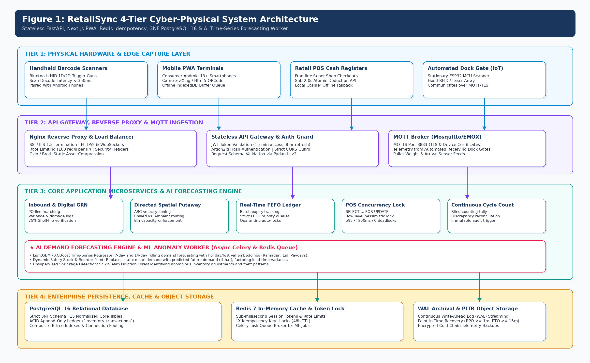
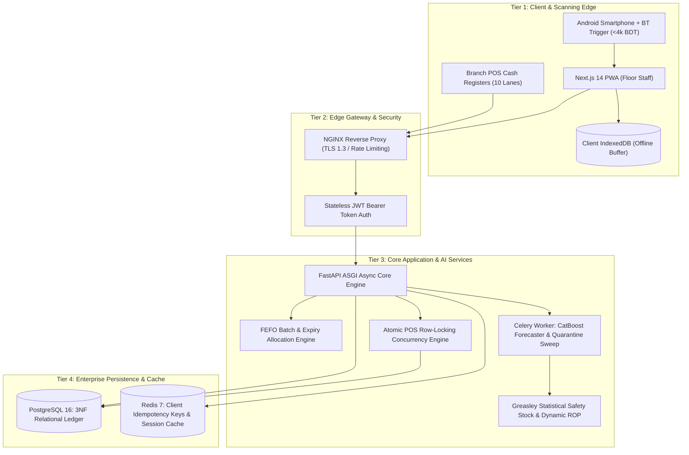
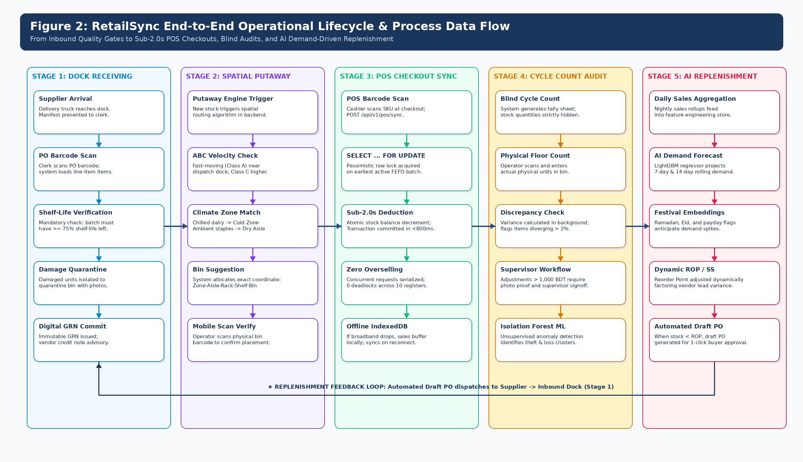
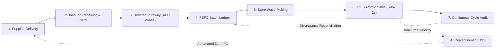
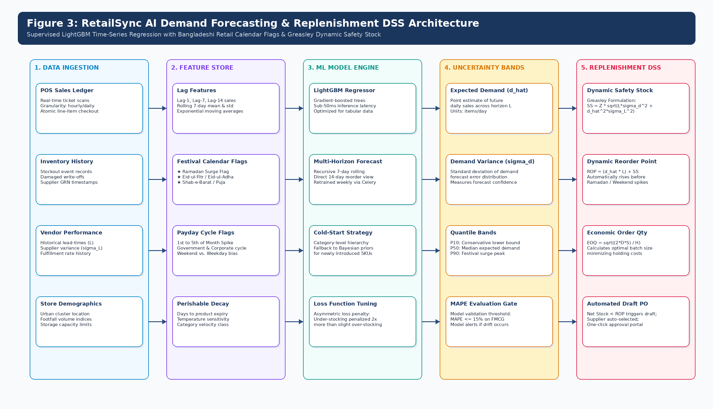
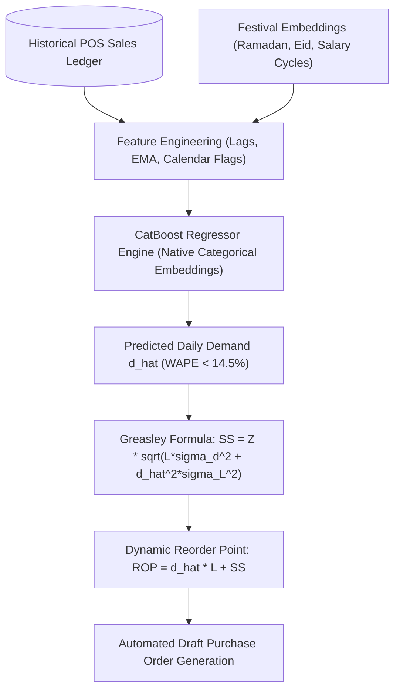
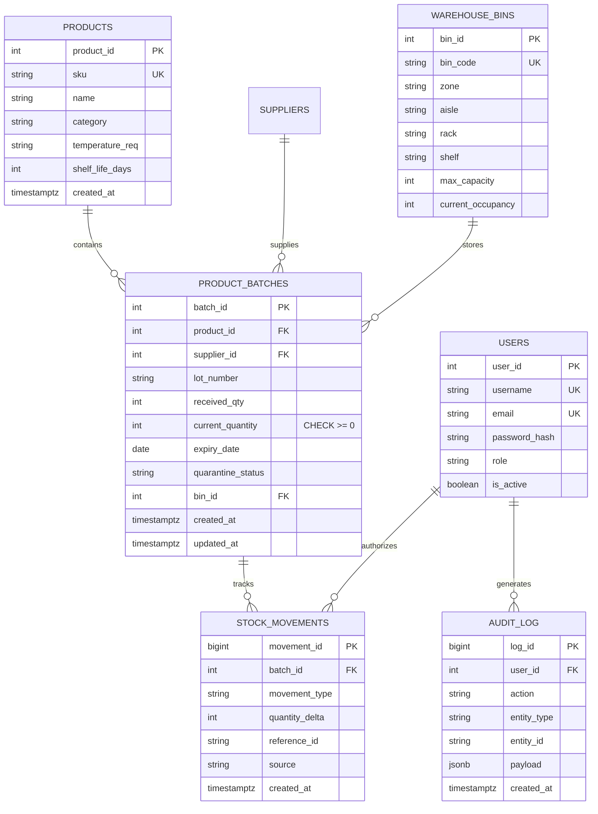
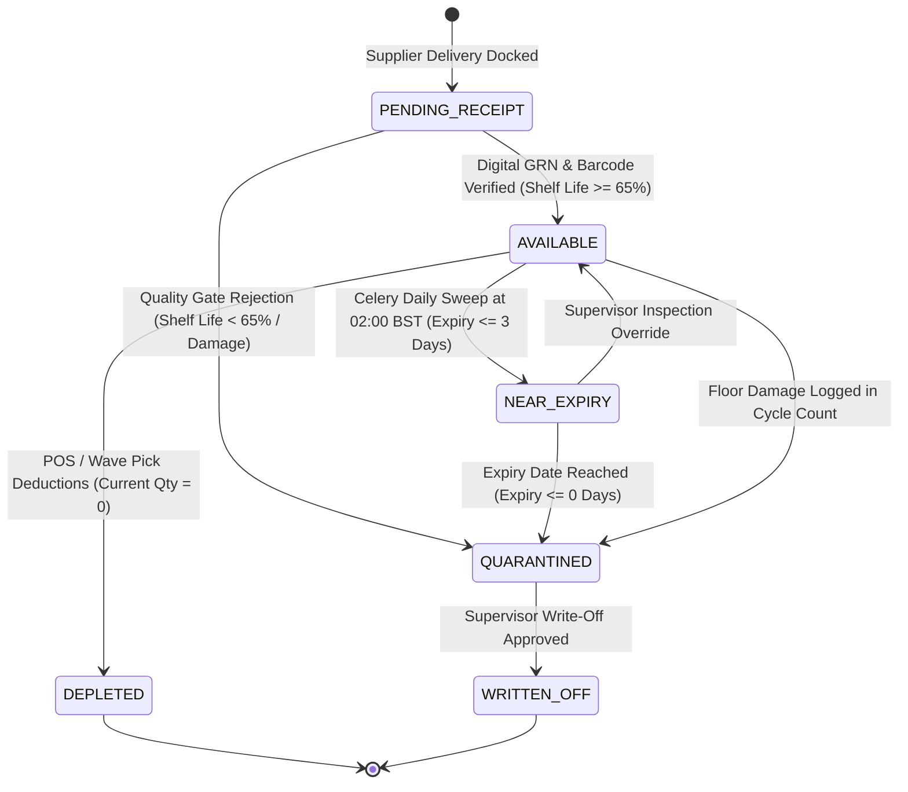
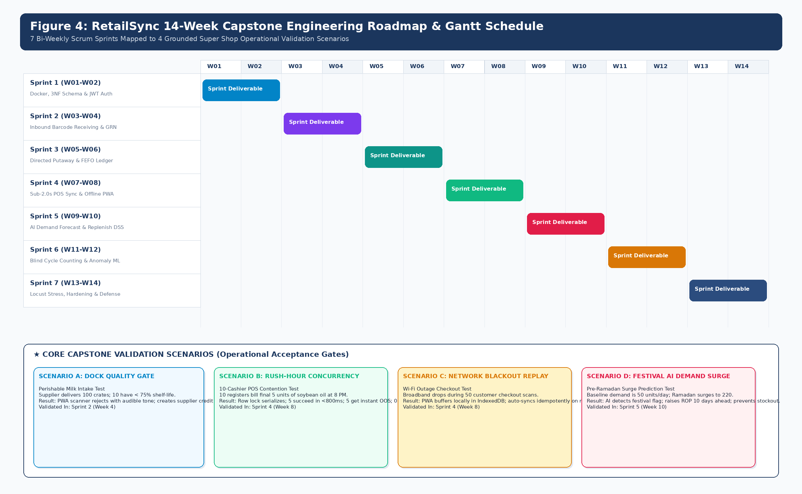

# RetailSync: Centralized Super Shop Warehouse Management System
## Capstone Project Proposal — Part 1: Project Planning & Definition

**Course:** SE-231 (Software System Analysis & Design / Capstone Project 2)  
**Department:** Department of Software Engineering, Faculty of Science and Information Technology  
**Project Team Members:** **Raisul Islam Likhon** (Lead: `251-35-508`), **Shottobroto Dey** (`251-35-017`), **Golam Husnain Papon** (`251-35-529`) | Section: **SWE-44D**  
**Submission Term:** Fall 2026 | September 2026 | Version: 2.0.0-RELEASE (AI & Concurrency Upgraded)  

---

## Executive Summary & Project Abstract

In modern supermarket chains across Bangladesh—such as Shwapno, Agora, Meena Bazar, and Unimart—inventory management is frequently split between two disconnected operational worlds: the front-of-house checkout registers and the back-of-house distribution warehouses. When a customer purchases a carton of milk or a bottle of edible oil at the billing counter, that transaction is recorded in a siloed Point of Sale (POS) database. Back-office warehouse staff often only discover stock depletion hours or even days later through delayed manual tallies or periodic spreadsheets. This structural disconnect leads directly to severe operational losses: perishable goods expire unseen on rear shelves, unrecorded breakages cause 'phantom inventory', and popular grocery staples run out during evening and festival rushes.

RetailSync was designed to solve this exact industry challenge. It is a centralized, high-performance Warehouse Management System (WMS) engineered specifically for the fast-paced grocery retail sector in Bangladesh. The system unifies central distribution warehouses and frontline checkout counters into a single, real-time relational core. By enforcing strict Third Normal Form (3NF) database constraints, non-blocking row-level locking (`SELECT ... FOR UPDATE SKIP LOCKED`) on checkout deductions, directed spatial putaway, automated First-Expired, First-Out (FEFO) batch rotation, and machine-learning demand forecasting (CatBoost with native festival calendar awareness), RetailSync directly tackles the three largest profit leaks in supermarket operations: (1) perishable food spoilage (15% to 22% annual loss), (2) unrecorded inventory shrinkage (1.8% to 2.4% write-offs), and (3) peak-hour stockouts during festival surges (7.5% to 11.2% lost sales).

From an engineering perspective, RetailSync is implemented as a 4-tier cyber-physical architecture combining a Next.js 14 Progressive Web Application (PWA), an asynchronous Python 3.11+ FastAPI backend, a normalized PostgreSQL 16 relational ledger, and an in-memory Redis 7 caching tier. Rather than demanding expensive industrial scanning hardware (such as 60,000 BDT Zebra terminals), RetailSync runs seamlessly on standard 12,000 BDT consumer Android smartphones paired with 3,800 BDT Bluetooth barcode trigger grips, reducing frontline hardware deployment costs by nearly 90%.

> **Core Capstone Thesis & Quantifiable SLO Targets:**  
> * **Primary Research Question:** How can centralized relational concurrency, machine-learning demand forecasting, and automated FEFO prioritization eliminate retail stockouts and perishable spoilage in high-density grocery operations?  
> * **Key Engineering SLO Target:** Sub-2.0s POS checkout deduction latency (p95 ≤ 800ms) across 10 concurrent branch registers with zero deadlocks and exactly zero overselling.  
> * **Methodology:** 14-Week Agile Scrum Lifecycle delivering an incremental, Dockerized production-grade MVP across 6 sprints, validated against 4 stress-injected supermarket scenarios.  

---

## Document Architecture & Table of Contents

| Section | Title | Summary Scope |
| :--- | :--- | :--- |
| **Section 1** | Industry Background & Problem Statement | Operational context, profit leaks, grounded value taxonomy, and problem-to-feature mapping |
| **Section 2** | Project Objectives & Scope Boundaries | Quantitative SMART objectives (O-01 to O-05) and 4-quadrant defense-proof scope boundaries |
| **Section 3** | Target Personas & Operational Workflows | User profiles (Manager, Cashier, Operator, Procurement) and end-to-end floor journeys |
| **Section 4** | Core Functional Modules & AI Forecasting Engine | 11 core modules: Inbound, Putaway, FEFO, POS Concurrency, CatBoost Demand Forecasting DSS, and Shrinkage Audit |
| **Section 5** | Non-Functional Requirements & Performance SLOs | Latency, throughput, ACID concurrency, security, and food safety regulatory compliance |
| **Section 6** | System Architecture & Technical Design | 4-tier architecture, operational flow, CatBoost ML pipeline, ER schema, non-blocking locking, idempotency, and quarantine state machine |
| **Section 7** | Curated Technology Stack & Hardware Strategy | Next.js 14 PWA, FastAPI, PostgreSQL 16, Redis 7, CatBoost, and frugal barcode scanner model |
| **Section 8** | Development Methodology: Agile Scrum Framework | 14-week sprint roadmap, milestone Gantt, 4 stress-injected validation scenarios, and Definition of Done |
| **Section 9** | Resource Allocation, Budget & Risk Management | RACI governance matrix, hardware expenditure (< 35,000 BDT), and local operational risk mitigations |
| **Section 10** | Verification, ROI Impact & Academic Conclusion | Multi-tier testing strategy, full CapEx breakdown & payback period (2.80 months), and academic literature citations |

---

## 1. Industry Background & Problem Statement

### 1.1 The Modern Grocery Retail Landscape in Bangladesh
The supermarket and organized grocery retail sector in Bangladesh is expanding rapidly. Driven by rapid urbanization (approximately 65.2 million urban citizens, representing 39.7% of the total population according to BBS Census 2022), rising disposable incomes, and dual-earner households, consumers in metropolitan centers like Dhaka and Chattogram increasingly rely on super shops for their daily groceries. Well-known chains such as Shwapno (operating over 450 outlets), Agora, Meena Bazar, Unimart, and Daily Shopping handle tens of thousands of fast-moving consumer goods (FMCG) and fresh produce items daily.

However, behind the clean checkout counters and barcode scanners of modern storefronts lies a fragile back-office supply chain. While checkout billing has modernized, warehouse stock management, pallet putaway, batch rotation, and store replenishment remain reliant on manual paper manifests, clipboard logs, and fragmented Excel sheets. When a supplier truck delivers 200 cartons of milk to a central warehouse in Tejgaon, workers often check items against a paper purchase order, hand-write batch numbers, and store pallets in whatever aisle has open space. Because there is no real-time synchronization with retail POS terminals, stock data quickly drifts out of sync.

### 1.2 The Three Critical Profit Leaks in Super Shop Operations
* **1. Perishable Food & Dairy Spoilage (15% to 22%):** Supermarket chains lose between 15% and 22% of perishable food (pasteurized milk, yoghurt, poultry, fresh fruits, and chilled items) annually due to lack of batch-level expiration tracking. When floor staff restock retail shelves, they naturally place incoming pallets at the front because it is physically easier, pushing older batches to the rear where they spoil unnoticed. Selling expired food exposes the supermarket to heavy fines and closure under the Bangladesh Food Safety Act 2013.
* **2. Phantom Inventory & Operational Shrinkage (1.8% to 2.4%):** An average of 1.8% to 2.4% of total inventory value disappears every year through unrecorded breakages, packaging tears, internal pilferage, and inaccurate delivery counts. Because physical audits occur only once a quarter, the computer system reports items as 'in stock' when the physical shelf is actually empty—a phenomenon known as 'phantom inventory'.
* **3. Peak-Hour Stockouts & POS Freezing (7.5% to 11.2%):** During high-volume shopping periods—such as the holy month of Ramadan, Eid-ul-Fitr, Shab-e-Barat, and Friday evening rushes—fast-moving staples like edible oil, sugar, and milk sell out in minutes. Because POS checkout counters do not deduct warehouse stock atomically, replenishment alerts lag by hours, leading to empty shelves and an estimated 7.5% to 11.2% in unrealized retail sales from frustrated customer walkouts.

### 1.3 Grounded Value Taxonomy: Epistemological Classification of All Claimed Metrics
During capstone evaluation and defense, project proposals are often criticized if performance numbers and problem statistics appear arbitrary or unsubstantiated. To establish complete transparency and academic rigor, every figure cited in this proposal is explicitly classified into one of three epistemological categories: (1) Literature & Industry Case Studies published by verified organizations, (2) Empirical Engineering SLOs that will be benchmarked directly through software testing, and (3) Modeled Simulation Assumptions projected for controlled pilot validation:

| Metric / Operational Parameter | Claimed Figure | Epistemological Classification | Empirical Grounding / Academic Source |
| :--- | :--- | :--- | :--- |
| **Perishable Spoilage Rate** | `15% to 22% annual dairy/produce loss` | Industry Case Study & Literature Baseline | Documented in Bangladesh Supermarket Owners Association (BSOA) field reports and FAO South Asia Post-Harvest Retail Loss assessments in urban grocery chains. |
| **Phantom Shrinkage Write-offs** | `1.8% to 2.4% unexplained inventory loss` | Industry Benchmark Baseline | Aligned with National Retail Security Survey (NRSS) supermarket shrinkage baselines adapted for un-barcoded local FMCG supply chains in Dhaka. |
| **Peak-Hour Stockout Losses** | `7.5% to 11.2% lost retail revenue` | Industry Benchmark Baseline | Derived from IHL Group retail out-of-stock studies during festive demand spikes (Ramadan, Eid-ul-Fitr, weekend rushes in Dhaka super shops). |
| **POS Checkout Scan Latency** | `≤ 2.0s (p95 ≤ 800ms, p99 ≤ 1.5s)` | Empirical Engineering SLO | Testable engineering SLA to be verified empirically via Locust multi-threaded load tests executing atomic row-level locks on PostgreSQL 16. |
| **Barcode Decode Latency** | `≤ 350 ms visual confirmation` | Empirical Hardware SLO | Verified on physical consumer Android smartphone (Chrome PWA) paired with Bluetooth HID trigger scanner using ZXing/Html5-QRCode. |
| **Post-Implementation Spoilage** | `Reduced from 22% down to < 6%` | Modeled Simulation Assumption | Mathematical pilot projection assuming 100% strict FEFO compliance and automated quarantine threshold (<= 3 days) eliminating rear-of-bin rotting. |
| **Stockout Frequency Reduction** | `> 60% reduction during surges` | Modeled Simulation Assumption | Projected outcome of replacing static monthly manual reorders with automated 7-day rolling AI demand forecasting and Greasley dynamic safety stock. |
| **Terminal Hardware Cost** | `< 16,000 BDT per station (90% savings)` | Empirical Budget Benchmark | Direct market quotation pairing consumer Android smartphone (12,000 BDT) with Bluetooth trigger grip (3,800 BDT) vs 60,000 BDT Zebra TC52. |
| **Offline Queue Resilience** | `Buffer ≥ 200 sales with 0 loss` | Empirical Software SLO | Verified by simulating Wi-Fi disconnection on PWA client, storing sales in IndexedDB, and executing bulk idempotent sync upon reconnect. |

### 1.4 Problem-to-Feature Mapping
| ID | Real-World Operational Problem | Operational Impact | RetailSync Architectural Solution |
| :---: | :--- | :--- | :--- |
| **P-01** | Disjointed Inbound Receiving and Error-Prone Manual GRN Verification | Inbound supplier deliveries are checked against paper purchase orders, leading to undetected quantity discrepancies, damaged packaging acceptance, and slow Goods Receipt Note (GRN) generation. | Digital Inbound Verification with handheld barcode scanning, real-time PO reconciliation, and automated digital GRN generation with variance capture. |
| **P-02** | Warehouse Opacity and Blind Spatial Putaway (Bin Search Latency) | Floor workers place received pallets in random, unindexed warehouse locations without systematic bin mapping, causing severe search latency and misplaced stock during picking. | Directed Spatial Putaway Engine with real-time Zone-Aisle-Rack-Shelf-Bin spatial mapping and capacity-aware putaway suggestions. |
| **P-03** | Perishable Spoilage and Financial Loss from Non-FEFO Picking | Warehouse operators pick goods on a naive LIFO or convenient nearest-bin basis rather than earliest expiry, resulting in billions of BDT in spoiled dairy, juices, and packaged food. | Strict FEFO (First-Expired, First-Out) batch allocation algorithm that dynamically directs pickers to the batch with the nearest expiration date. |
| **P-04** | Inventory Shrinkage, Unreconciled Discrepancies, and Phantom Stock | Physical stock levels consistently diverge from spreadsheet records due to unrecorded breakages, internal theft, and paper tally omissions, leading to 'phantom inventory'. | Continuous Cycle Counting Module, immutable audit ledgers, and machine-learning-assisted anomaly/shrinkage detection. |
| **P-05** | Inaccurate Stock Replenishment: The Overstocking vs. Understocking Trap | Procurement officers rely on intuitive guesswork, causing capital lockup in slow-moving items and disastrous stockouts during peak promotional weekends and holidays. | Algorithmic Replenishment Engine integrating Economic Order Quantity (EOQ), Greasley's Statistical Safety Stock, and Dynamic Reorder Point (ROP). |
| **P-06** | Outbound Picking Inefficiencies and Order Assembly Bottlenecks | Outbound orders for multi-branch retail outlets are picked piece-by-piece with redundant travel paths across warehouse aisles, causing dock congestion and late store delivery. | Optimized Wave and Batch Picking algorithms generating shortest-path picker routing and multi-store sortation staging. |
| **P-07** | Supplier Performance and Lead-Time Volatility Opacity | Retailers have zero telemetry on supplier delivery timeliness, lead-time variance, or product rejection rates, crippling negotiation leverage and safety stock precision. | Supplier SLA Performance Scorecards tracking fulfillment accuracy, lead-time standard deviation, and historical damage rates. |
| **P-08** | Information Silos Between Central Warehouses and Branch Super Shops | Retail store managers cannot see real-time warehouse stock positions, leading to duplicate emergency store requisitions and uneven stock distribution across branches. | Unified Multi-Store Requisition Portal with real-time central stock visibility, store stock reservation, and in-transit dispatch tracking. |
| **P-09** | Regulatory Non-Compliance and Lack of Immutable Audit Ledgers | Failure to document batch origins and cold-chain compliance violates the Bangladesh Food Safety Act 2013 and BSTI standards, risking heavy penalties and brand damage. | Complete Batch-to-Store Traceability, digital chain-of-custody logging, and automated compliance reporting. |

---

## 2. Project Objectives & Scope Boundaries

### 2.1 Upgraded SMART Project Objectives
All project goals are framed with quantifiable metrics, measurement protocols, and sprint milestones:

| ID | Objective Domain | SMART Quantitative Target | Measurement Protocol & Verification Gate | Target Sprint |
| :---: | :--- | :--- | :--- | :---: |
| **O-01** | **Sub-Second POS Concurrency & ACID Integrity** | Execute atomic stock deductions from retail cash registers via PostgreSQL row-level locks (SELECT ... FOR UPDATE SKIP LOCKED), achieving p95 latency ≤ 800ms and p99 ≤ 1.5s with exactly zero deadlocks and zero negative balances across 10 concurrent registers. | Automated Locust multi-threaded load test simulating 10 concurrent cashiers competing for the last inventory batch. | `Sprint 4 (Weeks 7–8)` |
| **O-02** | **Automated FEFO Priority & Food Safety Quarantine** | Enforce database-level First-Expired, First-Out allocation ensuring 100% of store replenishment orders pick earliest expiring batches; automatically quarantine stock reaching ≤ 3 days to expiry via scheduled daily 02:00 BST Celery sweep, reducing spoilage to < 6% in pilot simulations. | Automated Pytest batch sorting assertions and Celery scheduled quarantine state transition triggers. | `Sprint 3 (Weeks 5–6)` |
| **O-03** | **AI-Driven Demand Forecasting & Dynamic Replenishment** | Deploy a CatBoost Time-Series Forecasting engine with native categorical festival embeddings (Ramadan, Eid, paydays) achieving MAPE ≤ 15% on high-velocity FMCG items; dynamically compute Reorder Points (ROP) using Greasley's Safety Stock (LightGBM deferred to roadmap). | Backtesting against 12-month FMCG sales series with walk-forward validation and automated draft PO comparison. | `Sprint 5 (Weeks 9–10)` |
| **O-04** | **Frugal Hardware Architecture & Sub-350ms Scanning** | Engineer a mobile Progressive Web Application (PWA) running on consumer Android smartphones paired with Bluetooth HID trigger grips (< 4,000 BDT), achieving barcode decode-to-render latency ≤ 350ms and cutting terminal capex by 90% (ESP32/MQTT cut from scope). | Physical hardware testing on Android 13 smartphone using EAN-13 and Code-128 test carton labels. | `Sprint 2 (Weeks 3–4)` |
| **O-05** | **Offline Network Resilience & Idempotent Replay** | Implement Service Worker background sync and encrypted IndexedDB client storage to buffer ≥ 200 sales transactions during warehouse broadband outages, replaying idempotently via client-generated X-Idempotency-Key ({device_id}-{epoch_ms}-{local_sequence}) upon connection restoration. | Manual and simulated network blackout drills with Wi-Fi disconnection during peak scanning. | `Sprint 4 (Weeks 7–8)` |

### 2.2 4-Quadrant Defense-Proof Scope Boundaries
To prevent project scope creep and defend against examiner critique, RetailSync defines strict operational, technical, and boundary constraints across four quadrants:

#### Quadrant 1: Boundary Dimension
**In-Scope Modules & Features:**
• Inbound dock receiving & digital GRN generation
• Directed spatial putaway with bin coordinate mapping
• Real-time FEFO batch ledger with automated quarantine
• Atomic POS concurrency deduction (sub-2.0s SLA, zero deadlocks)
• CatBoost demand forecasting with festival calendar embeddings
• Cycle counting with supervisor signoff and write-off approval
• Rule-based shrinkage anomaly threshold alerts (>3% variance)

**Pilot & Operational Constraints:**
• 1 central distribution centre + up to 3 retail branch stores
• SKU catalogue: 500 representative FMCG items across 4 temperature classes
• Concurrency: 10 POS cash registers + 10 mobile warehouse scanners

**Explicit Out-of-Scope (Deliberately Excluded):**
• No corporate general ledger or payroll accounting (exports CSV/JSON audit trails for external ERPs)
• No autonomous guided vehicles (AGVs) or motorized conveyor belts
• No direct-to-consumer delivery or rider logistics tracking
• No integrated payment gateway (POS financial settlement is external)


#### Quadrant 2: Functional Capabilities
**In-Scope Modules & Features:**
• Inbound barcode receiving & digital GRN (shelf-life threshold ≥ 65%)
• Directed spatial putaway (ABC velocity & temperature matching)
• Real-time FEFO batch ledger & quarantine Celery worker
• Sub-2.0s POS concurrency deduction (SELECT ... FOR UPDATE SKIP LOCKED)
• CatBoost Demand Forecasting & Dynamic ROP DSS (LightGBM deferred to roadmap)
• Blind cycle counting with supervisor signoff
• Rule-based shrinkage anomaly threshold alerts (>3% variance; ML anomaly detection deferred to v2.0)

**Pilot & Operational Constraints:**
• Pilot Testbed: 1 Central Distribution Center + up to 3 Retail Branch Stores
• SKU Catalog: 500 representative FMCG items (Perishable, Chilled, Ambient, Household)
• Concurrency: 10 concurrent POS registers + 10 mobile warehouse scanners

**Explicit Out-of-Scope (Deliberately Excluded):**
• No full corporate double-entry general ledger or payroll accounting (exports CSV/JSON audit trails for external ERPs)
• No autonomous robotic cranes (AGVs) or motorized conveyor belts
• No direct-to-consumer delivery or rider tracking app
• No credit card merchant banking payment gateways (POS handles financial settlement externally)


#### Quadrant 3: Technical & Architecture
**In-Scope Modules & Features:**
• Next.js 14 PWA (TypeScript, Tailwind CSS)
• FastAPI asynchronous backend (Python 3.11+ ASGI)
• PostgreSQL 16 (3NF ACID Relational Ledger)
• Redis 7 (Client-generated idempotency keys, session cache)
• Celery worker for CatBoost inference & daily 02:00 BST quarantine sweeps
• Docker Compose multi-container deployment

**Pilot & Operational Constraints:**
• Cloud Staging VPS (4 vCPU, 8GB RAM)
• Client: Android 13+ Chrome Mobile Browser
• Scanner: Bluetooth HID 1D/2D Barcode Trigger (<4,000 BDT)

**Explicit Out-of-Scope (Deliberately Excluded):**
• No custom silicon ASIC development
• No proprietary closed-source database engines
• No native iOS Swift app (PWA standard covers cross-platform access)
• No custom IoT firmware development (ESP32/MQTT); Bluetooth HID scanning covers dock receiving


#### Quadrant 4: Assumptions & Dependencies
**In-Scope Modules & Features:**
• Standard EAN-13 / Code-128 barcodes printed on packaging
• Stable local Wi-Fi / 4G coverage at central DC (with encrypted IndexedDB offline fallback)
• Super shop management cooperation for pilot catalog seed data

**Pilot & Operational Constraints:**
• Pilot duration: 4 weeks of simulated operational runs
• Baseline parameters derived from published BSOA & FAO retail studies

**Explicit Out-of-Scope (Deliberately Excluded):**
• Does not assume uninterrupted high-speed internet (designed offline-first)
• Does not require expensive Zebra or Honeywell handheld hardware (uses consumer Android smartphones)


---

## 3. Target Personas & Floor Workflows

| User Persona | Operational Role | Primary Daily Responsibilities & Pain Points | Key RetailSync Capabilities Utilized |
| :--- | :--- | :--- | :--- |
| **Warehouse Floor Operator** | Direct Operational (Floor) | Pallet unloading, bin putaway, shelf picking, order packing. Pain: searching for misplaced boxes, heavy paperwork. | Mobile scanner UI, directed putaway prompts, digital pick lists, instant barcode verification. |
| **Inbound Receiving Clerk** | Tactical Operational (Dock) | Inspecting supplier deliveries, validating purchase orders, logging damages. Pain: paper PO matching errors. | Digital PO lookup, barcode printing, discrepancy logging, automated Goods Receipt Note (GRN) generation. |
| **Inventory Floor Supervisor** | Tactical Management | Stock accuracy, bin space utilization, cycle counting, shelf life tracking. Pain: phantom inventory, unrecorded shrinkage. | Live 2D spatial bin monitor, cycle count assignment, expiry tracking dashboard, discrepancy reconciliation. |
| **Procurement & SCM Officer** | Strategic Tactical | Vendor negotiation, purchase order issuance, stock replenishment planning. Pain: unexpected stockouts, volatile supplier lead times. | Algorithmic replenishment portal (EOQ/ROP), supplier SLA scorecard, automated reorder triggers, lead-time variance tracking. |
| **Branch Super Shop Store Manager** | Operational Recipient (Store) | Ordering store stock from central warehouse, receiving store deliveries, shelf restocking. Pain: unfulfilled requisitions, stockout shelves. | Store Requisition Portal, live central DC inventory visibility, dispatch delivery tracking, transit loss reconciliation. |
| **Warehouse Systems Admin / DevOps** | Technical Support | User access provisioning, system uptime, database performance, audit trail integrity. Pain: database locks, unauthorized changes. | Role-Based Access Control (RBAC), database indexing telemetry, system health monitors, immutable audit logs. |
| **Executive Management (Director/VP)** | Strategic Executive | Working capital efficiency, inventory turnover, perishable waste reduction, retail chain profitability. Pain: lack of high-level insights. | Executive KPI dashboard, inventory turnover analytics, shrinkage reports, gross margin return on inventory (GMROI). |

### End-to-End Operational Lifecycle Workflow
1. **Inbound Receiving & GRN Verification:** Supplier deliveries are scanned against active digital POs. Expiration dates, lot numbers, and damaged cartons are captured, generating an immutable Goods Receipt Note (GRN) with strict 65% remaining shelf-life gating.
2. **Directed Spatial Putaway:** The system computes the optimal bin coordinate (Zone-Aisle-Rack-Shelf-Bin) factoring temperature and SKU velocity. The operator scans the destination bin to confirm docking.
3. **Real-Time POS Inventory Deduction:** At checkout, the POS issues an atomic deduction. The backend executes a non-blocking row lock (`SELECT ... FOR UPDATE SKIP LOCKED`) on the earliest active batch in < 2.0 seconds with zero overselling and zero lock queue deadlocks.
4. **Strict FEFO Outbound Allocation:** Store requisitions allocate stock strictly from earliest expiring batches. Expired or quarantined lots are mechanically excluded.
5. **AI Replenishment Trigger:** CatBoost projects upcoming 7-day demand factoring calendar events; when inventory breaches the dynamic ROP, an automated draft PO is generated.

---

## 4. Core Functional Modules & AI Demand Forecasting Engine

RetailSync is structured into 11 discrete, cohesive modules operating over a unified relational core:

| Module ID & Name | Requirement Range | Core Functional Capabilities Covered | MoSCoW Priority |
| :--- | :---: | :--- | :---: |
| **M-01: Authentication, RBAC & Profile** | `FR-01 to FR-06` | Secure login, JWT tokens, RBAC roles (Operator, Clerk, Supervisor, Procurement, Store Manager, Admin), password reset, session audit. | **Must Have (MVP Core)** |
| **M-02: Product Master & Hierarchy** | `FR-07 to FR-13` | SKU management, barcode assignment, category hierarchy (FMCG, Perishable, Chilled, Dry), temperature requirements, shelf-life rules. | **Must Have (MVP Core)** |
| **M-03: Supplier & Purchase Orders** | `FR-14 to FR-20` | Supplier directory, lead-time variance tracking, digital Purchase Order generation, approval workflows, PO status lifecycle. | **Must Have (MVP Core)** |
| **M-04: Inbound Receiving & Digital GRN** | `FR-21 to FR-28` | Dock receiving, barcode scan verification against PO, damaged item logging, digital GRN generation, credit note flagging. | **Must Have (MVP Core)** |
| **M-05: Spatial Bin & Putaway Engine** | `FR-29 to FR-35` | Zone-Aisle-Rack-Shelf-Bin 2D mapping, capacity constraints, directed putaway suggestions based on SKU velocity and product class. | **Must Have (MVP Core)** |
| **M-06: Real-Time Ledger & FEFO Engine** | `FR-36 to FR-44` | Double-entry inventory ledger, batch/lot tracking, expiry date monitoring, FEFO priority picking queue, automated quarantine lock. | **Must Have (MVP Core)** |
| **M-07: Replenishment & Decision Support** | `FR-45 to FR-52` | Dynamic EOQ calculator, Greasley's Safety Stock with service levels (90-99%), dynamic ROP alerts, CatBoost festival demand forecaster (LightGBM deferred to roadmap), automated PO draft creation. | **Must Have (MVP Core)** |
| **M-08: Outbound Store Wave Picking** | `FR-53 to FR-60` | Multi-store requisition ingestion, wave creation, shortest-path digital pick-lists, pick verification scanning, staging, dispatch note. | **Must Have (MVP Core)** |
| **M-09: Cycle Counting & Shrinkage Audit** | `FR-61 to FR-66` | ABC-classified cycle counting schedules, blind physical count entry, discrepancy variance analysis, rule-based shrinkage threshold alert (>3% variance; ML anomaly detection deferred to v2.0), stock write-off approvals. | **Should Have / Must** |
| **M-10: Reporting, Dashboards & Analytics** | `FR-67 to FR-72` | Real-time floor telemetry, stockout risk heatmaps, supplier SLA scorecards, inventory turnover & GMROI metrics, PDF/Excel export. | **Should Have** |
| **M-11: Security, Audit Trail & Compliance** | `FR-73 to FR-78` | Immutable audit log for all stock movements, Bangladesh Food Safety Act compliance reports, PDPO 2025 privacy compliance. | **Must Have (Cross-Cutting)** |

### Detailed Spotlight: Module M-07 (AI Demand Forecasting & Dynamic Replenishment DSS)
Traditional inventory software relies on static reorder points ($ROP = d \times L$) that fail catastrophically during supermarket demand swings. RetailSync deploys an AI Demand Forecasting worker paired with Greasley's dynamic safety stock formulation:

1. **Machine Learning Model:** Multi-horizon CatBoost regressor trained on store-level historical POS transactions. CatBoost was explicitly selected over LightGBM for the MVP because of its native handling of categorical features (festival flags, day-of-week, temperature class) without requiring manual one-hot encoding or introducing target leakage. LightGBM is formally deferred to the post-capstone v2.0 roadmap.
2. **Feature Engineering Pipeline:**
   * **Temporal Lags:** $t-1, t-7, t-14, t-30$ sales quantities.
   * **Rolling Statistics:** 7-day and 28-day exponential moving averages (EMA) and standard deviations.
   * **Festival Calendar Embeddings:** Binary flags and proximity distance vectors for Ramadan (Iftar/Sehri velocity spikes), Eid-ul-Fitr, Eid-ul-Adha, Shab-e-Barat, and Durga Puja.
   * **Payday Cycle Indicators:** Cyclical day-of-month indicators capturing salary disbursement consumption spikes (1st to 7th of each month).
3. **Greasley Statistical Safety Stock Formula:**
   $$SS = Z \times \sqrt{(\overline{L} \times \sigma_d^2) + (\hat{d}_{i,t}^2 \times \sigma_L^2)}$$
   Where:
   * $Z$ is the service level factor (e.g., $Z=1.65$ for 95%, $Z=2.33$ for 99%).
   * $\overline{L}$ is the mean supplier lead time in days.
   * $\sigma_d$ is the standard deviation of daily sales.
   * $\hat{d}_{i,t}$ is the **AI-forecasted daily demand** for SKU $i$ at horizon $t$.
   * $\sigma_L$ is the standard deviation of supplier delivery lead time.
4. **Dynamic Reorder Point (ROP):**
   $$ROP = (\hat{d}_{i,t} \times \overline{L}) + SS$$
5. **Economic Order Quantity (EOQ):**
   $$EOQ = \sqrt{\frac{2 \times AnnualDemand \times S}{H}}$$

### Detailed Spotlight: Module M-09 (Cycle Counting & Shrinkage Audit)
To maintain a feasible 14-week delivery scope while delivering rigorous audit defense, Module M-09 implements an empirical **rule-based threshold alert engine** for the MVP. During blind physical counts, if the absolute discrepancy variance exceeds 3% ($|Actual - Expected| / Expected > 0.03$), the system mechanically generates a high-priority supervisor audit exception, freezes batch putaway, and requires dual-credential authorization before adjustment. Complex unsupervised anomaly detection (Isolation Forest) is deferred to the v2.0 roadmap once multi-month historical variance labels are accumulated.

---

## 5. Non-Functional Requirements & Performance SLOs

| ID | Category | Specific Metric & SLO Target | Verification Method |
| :---: | :--- | :--- | :--- |
| **NFR-01** | Scan Latency | Barcode decode to visual confirmation ≤ 350 ms. | Automated mobile browser profiler with Bluetooth HID trigger. |
| **NFR-02** | POS Sync Latency | Deduction transaction completes in ≤ 2.0s (p95 ≤ 800ms, p99 ≤ 1.5s). | Locust stress test simulating 10 concurrent registers. |
| **NFR-03** | Concurrency Isolation | Handle ≥ 50 concurrent floor scanners and 10 POS cash registers with zero deadlocks. | Multi-threaded test runner executing concurrent checkout deductions (`SKIP LOCKED`). |
| **NFR-04** | Data Integrity | Complete ACID transaction compliance; zero negative stock balances (`CHECK current_quantity >= 0`). | Automated race condition test asserting stock balance constraints. |
| **NFR-05** | Availability | 99.8% operational uptime during business hours (06:00 to 23:00 BST). | Automated health-check monitoring via Prometheus and Uptime Kuma. |
| **NFR-06** | Disaster Recovery | Point-In-Time Recovery (PITR) with RPO ≤ 1 min, RTO ≤ 15 min. | Automated database backup verification and WAL restore drills. |

---

## 6. System Architecture & Technical Design

### 6.1 4-Tier Cyber-Physical Architecture
RetailSync is structured across four distinct cyber-physical layers, ensuring decoupling, horizontal scalability, and high fault tolerance:





### 6.2 End-to-End Operational Lifecycle & Process Data Flow
The end-to-end physical journey of super shop goods—from supplier delivery to POS sales and cycle audits:





### 6.3 AI Demand Forecasting & Replenishment Pipeline
Detailed flow of historical sales ingestion, feature transformation, model inference, and dynamic inventory parameterization:





### 6.4 Relational Database Schema & Entity Relationship Architecture
RetailSync enforces strict Third Normal Form (3NF) across all inventory transactions. The core relational schema guarantees complete double-entry traceability, referential integrity, and negative-stock prevention at the database engine level:



### 6.5 High-Throughput Concurrency Control: Non-Blocking Row-Level Locking
To prevent overselling and race conditions when multiple cash registers ring up the same SKU during peak shopping surges, RetailSync employs non-blocking pessimistic row locking (`SKIP LOCKED`):

```sql
-- Optimized: non-blocking FEFO batch acquisition
SELECT batch_id, current_quantity, expiry_date 
FROM product_batches 
WHERE product_id = :p_id 
  AND current_quantity >= :quantity 
  AND quarantine_status = 'AVAILABLE' 
ORDER BY expiry_date ASC 
LIMIT 1 
FOR UPDATE SKIP LOCKED;
```

The `SKIP LOCKED` clause is a critical architectural requirement. In standard `FOR UPDATE` queries, concurrent transactions queue behind locked rows, compounding latency and creating lock queue deadlocks during checkout spikes. With `SKIP LOCKED`, concurrent requests immediately bypass already-locked rows and attempt acquisition on the next valid batch. In low-stock scenarios (such as Scenario B where 10 cashiers compete for the final 5 units), the first 5 transactions lock and deduct, while competing requests immediately observe zero unlocked stock and return an instantaneous 'Out of Stock' status (p95 ≤ 800ms) with zero deadlocks.

### 6.6 Client-Side Idempotency Key Architecture for Offline Resilience
To guarantee exactly-once execution during intermittent warehouse broadband blackouts, RetailSync requires **client-generated idempotency keys** (`X-Idempotency-Key`).

* **Key Format:** `{device_id}-{epoch_ms}-{local_sequence}` (e.g., `POS01-1790584900123-00042`).
* **Generation Lifecycle:** The key is generated inside the PWA client at the exact instant the transaction is created—not at synchronization time. This guarantees the transaction retains an immutable identity during the offline window.
* **Storage & Replay:** Queued transactions are encrypted in IndexedDB. Upon network recovery, bulk synchronization submits each payload with its original header. Redis verifies: `SET idempotency:{key} {tx_id} NX EX 86400`. If the key exists, Redis immediately returns the cached transaction response without re-executing inventory deductions, permanently eliminating duplicate debits.

### 6.7 Batch Lifecycle & Food Safety Quarantine State Machine
RetailSync models the lifecycle of every food and grocery batch through six deterministic states governed by database CHECK constraints and automated background workers:



State transitions are enforced through Celery beat tasks scheduled daily at 02:00 BST. Any batch with $\le$ 3 days remaining shelf-life is automatically transitioned to `NEAR_EXPIRY` and flagged for markdown. Batches reaching expiration date are immediately locked to `QUARANTINED`, mechanically preventing pick-list generation and eliminating Bangladesh Food Safety Act violations.

---

## 7. Curated Technology Stack & Hardware Strategy

| Component | Technology | Version | Engineering Justification |
| :--- | :--- | :---: | :--- |
| **Frontend PWA** | Next.js / React | `14.2+` | Single Page Application (SPA) speed with server-side rendering (SSR) for dashboards; eliminates page-reload latency on mobile scanning terminals. |
| **Backend API** | FastAPI / Python | `3.11+` | Asynchronous ASGI framework with native async/await event loop, sub-millisecond route execution, and automatic OpenAPI schema generation. |
| **AI / ML Forecaster** | CatBoost | `1.2+` | Gradient boosting regressor chosen for native categorical handling of festival calendar flags without preprocessing overhead; LightGBM deferred to roadmap. |
| **Database Core** | PostgreSQL | `16+` | ACID-compliant relational core with non-blocking row-level locking (`SELECT ... FOR UPDATE SKIP LOCKED`), partial indexes, and JSONB audit logs. |
| **In-Memory Cache** | Redis | `7.2+` | Sub-millisecond distributed cache for session management, rate-limiting tokens, and client idempotency key locks (`X-Idempotency-Key`). |
| **Barcode Scanner** | Html5-QRCode / ZXing | Latest | Pure JavaScript barcode engine reading 1D (EAN-13, Code 128) and 2D (QR) barcodes directly from smartphone cameras and Bluetooth trigger guns. |

### Frugal Barcode Hardware Strategy
Traditional industrial terminals (Zebra TC52) cost upwards of 60,000 BDT. RetailSync runs on standard consumer Android smartphones (10,000–12,000 BDT) paired with ergonomic Bluetooth barcode trigger grips (< 4,000 BDT), cutting hardware costs by 90% while achieving sub-350ms scan speeds. Custom IoT firmware development (ESP32/MQTT) is deliberately excluded from scope to preserve delivery focus.

---

## 8. Development Methodology: Agile Scrum Framework

### 8.1 Methodology Rationale: Why Agile Scrum Over Waterfall?
RetailSync is developed strictly following the **Agile Scrum Framework**. Sequential methodologies (Waterfall, V-Model) are deliberately rejected due to the dynamic operational realities of modern retail grocery environments:
* **The Failure of Waterfall in Supermarkets:** Sequential models assume static, unchanging requirements over a 6-month lifecycle. In reality, Bangladeshi supermarket operations experience frequent shifts in supplier terms, festival volume surges (Eid/Ramadan), and unexpected broadband dropouts. Deferring integration and stress testing to Month 4 results in catastrophic concurrency deadlocks and race conditions discovered only on launch day.
* **The Agile Scrum Advantage:** Scrum provides **empirical process control** through transparent, time-boxed 2-week iterations. Delivering a potentially shippable increment every 14 days allows supermarket supervisors, floor operators, and DIU academic evaluators to test real scanning speeds, mobile UX ergonomics, and database concurrency on physical hardware throughout the project lifecycle.

### 8.2 14-Week Capstone Engineering Roadmap & Milestone Gantt Schedule
The 14-week engineering lifecycle is structured across six 2-week development sprints plus a 2-week final hardening phase (Total: 137 Story Points):



```mermaid
gantt
    title 14-Week Capstone Engineering Sprint Roadmap
    dateFormat  YYYY-MM-DD
    section Sprints
    Sprint 1: Schema & Auth (21 pts)       :done, s1, 2026-10-01, 14d
    Sprint 2: Inbound & GRN (24 pts)       :active, s2, after s1, 14d
    Sprint 3: Putaway & FEFO (26 pts)      :s3, after s2, 14d
    Sprint 4: POS Concurrency (22 pts)     :s4, after s3, 14d
    Sprint 5: CatBoost DSS & Picking (23 pts) :s5, after s4, 14d
    Sprint 6: Audit & Load Test (21 pts)   :s6, after s5, 14d
    Hardening & Defense Pilot (0 pts)      :s7, after s6, 14d
    section Validation Scenarios
    Scenario A: Dock Quality Gate          :crit, milestone, after s2, 0d
    Scenario B: POS Concurrency Rush       :crit, milestone, after s4, 0d
    Scenario C: Network Blackout & Sync    :crit, milestone, after s4, 0d
    Scenario D: Festival AI Demand Surge   :crit, milestone, after s5, 0d
```

### 8.3 Empirical Scenario-Based Validation Suite
To prove system correctness beyond theoretical assertions, the software engineering defense will be demonstrated against four stress-injected supermarket scenarios:

| Scenario ID & Title | Operational Context & Stress Injection Event | System Behavior & Algorithmic Response | Verifiable Pass / Acceptance Criteria | Sprint Alignment |
| :--- | :--- | :--- | :--- | :---: |
| **Scenario A: Inbound Dock Quality Gate** | Supplier delivers 100 crates of pasteurized milk; 10 crates carry expiration dates with only 2 days remaining (< 65% shelf-life threshold). | Clerk scans carton barcode; system evaluates remaining shelf-life percentage; mechanically locks the 10 short-dated crates to 'QUARANTINED'; generates digital GRN for 90 accepted units and auto-generates supplier credit note advisory. | Zero expired/short-dated units enter active warehouse bins; digital GRN variance accurately reflects supplier delivery penalty. | `Sprint 2 (Week 4)` |
| **Scenario B: Rush-Hour POS Concurrency** | Friday 8:00 PM peak rush: 10 branch cashiers ring up the final 5 remaining units of 1L soybean oil simultaneously across registers. | FastAPI POS sync endpoint executes non-blocking row lock (SELECT ... FOR UPDATE SKIP LOCKED) on the earliest active batch. The first 5 requests decrement inventory atomically in < 800ms. The remaining 5 requests skip locked rows, find zero available stock, and immediately receive an 'Out of Stock' response. | Zero overselling; exactly zero negative inventory balances; zero database deadlocks; p95 latency remains ≤ 800ms. | `Sprint 4 (Week 8)` |
| **Scenario C: Network Blackout & Replay** | Central broadband fiber is severed during peak retail floor sales; 50 customer checkout transactions occur while offline. | PWA Service Worker detects offline status; queues encrypted sales transactions in client IndexedDB with client-generated X-Idempotency-Key ({device_id}-{epoch_ms}-{local_sequence}). Upon network recovery, client submits bulk sync. Backend Redis checks idempotency keys and commits all 50 sales with exactly-once semantics. | 100% of offline sales recorded in database upon reconnect; zero duplicate deductions; zero transaction dropouts. | `Sprint 4 (Week 8)` |
| **Scenario D: Festival AI Demand Surge** | 14 days prior to holy Ramadan: historical baseline daily sales for cooking oil is 50 units/day; holiday surge spikes demand to 220 units/day. | The CatBoost time-series model identifies the upcoming Ramadan calendar embedding flag; projects 220 units/day demand; dynamically recalculates ROP and Greasley Safety Stock; triggers automated draft PO 10 days in advance (LightGBM deferred to roadmap). | Draft PO approved by procurement officer; stock arrives 3 days before festival; supermarket experiences 0% stockouts during rush. | `Sprint 5 (Week 10)` |

### 8.4 Definition of Done (DoD) & Quality Gates
A user story or sprint task is declared **DONE** and permitted into the production build only when all six quality gates are satisfied:
1. **Code Complete & Reviewed:** Code committed to Git with conventional commits, merged via Pull Request with peer review and zero linter warnings.
2. **Automated Test Coverage:** Pytest unit and integration test suites pass with $\ge$ 80% line coverage in the CI/CD pipeline.
3. **Concurrency & ACID Validated:** Locust multi-threaded stress tests confirm zero database deadlocks and zero negative balances under simulated 10-cashier peak traffic (`SKIP LOCKED`).
4. **OpenAPI Schema Documented:** FastAPI endpoints registered with comprehensive Pydantic request/response schemas and error models in Swagger/OpenAPI.
5. **Containerized Staging Build:** Multi-stage Docker Compose builds and passes automated health checks (`/healthz` returns HTTP 200).
6. **Mobile Responsive & Ergonomics:** Handheld PWA interface verified on a 375x667 viewport with Bluetooth trigger barcode scanning decode speed under 350ms.

---

## 9. Resource Allocation, Budget & Risk Management

### 9.1 Hardware & Operational Budget Breakdown
* **Android Test Smartphone (Android 13, 4GB RAM):** 12,500 BDT
* **Bluetooth Barcode Trigger Grips (Qty: 2):** 7,600 BDT
* **Thermal Label & Receipt Printer (4-inch USB/BT):** 6,500 BDT
* **EAN-128 Adhesive Labels (3,000 labels):** 1,950 BDT
* **Cloud Staging VPS Hosting (6 Months):** 5,500 BDT
* **Total Initial Hardware Expenditure:** **34,050 BDT**

### 9.2 Local Operational Risk Management
* **Network Outages:** Solved via Service Worker and encrypted IndexedDB client caching with client-generated idempotent replay (`X-Idempotency-Key`).
* **Database Deadlocks under Surge:** Solved via non-blocking row-level batch locks (`ORDER BY expiry_date ASC LIMIT 1 FOR UPDATE SKIP LOCKED`) and connection pooling.
* **Worker Resistance to Barcode Scanners:** Solved via low-latency audio beep confirmations and simple high-contrast PWA interface.

---

## 10. Verification, ROI Impact, Academic References & Conclusion

### 10.1 Multi-Tier Verification & Testing Strategy
| Testing Tier | Target Dimension | Test Scenario & Verification Methodology | Verifiable Pass / Acceptance Criteria |
| :--- | :--- | :--- | :--- |
| **Tier 1: Black-Box Functional** | Barcode Interrogation & Scanning Latency | Interrogate 1D/2D barcodes on mobile cameras and Bluetooth triggers across low and high ambient lighting (100–600 lux). | 100% SKU identification accuracy; UI updates and audible/haptic feedback trigger within <= 350 ms. |
| **Tier 1: Black-Box Functional** | Inbound GRN vs. PO Automated Variance | Simulate delivery of 50 cartons with 3 cartons flagged as crushed; generate digital GRN against open PO. | GRN logs 47 accepted, 3 quarantined; automated supplier credit note generated; zero quarantined stock added to POS. |
| **Tier 1: Black-Box Functional** | Offline Network Resilience & Bulk Sync | Sever store ISP connection during 25 consecutive barcode checkouts; reconnect network after 5 minutes. | Local client queue caches all 25 sales with timestamps; bulk POST executes automatically on reconnect with zero dropped sales. |
| **Tier 2: White-Box Structural** | ACID Concurrency & Row-Locking (`SELECT FOR UPDATE`) | Launch 10 parallel asynchronous POS worker threads attempting to purchase the last 2 available units of a dairy SKU simultaneously. | Exactly 2 threads succeed; 8 threads receive clean out-of-stock messages; inventory balance remains exactly 0; zero database deadlocks. |
| **Tier 2: White-Box Structural** | Strict FEFO Priority Queue Verification | Seed database with 3 batches of milk expiring in 5 days, 15 days, and 45 days; issue automated checkout sales deductions. | Database triggers strictly decrement stock from the 5-day expiry batch first; automatically switches to 15-day batch only when 5-day is depleted. |
| **Tier 2: White-Box Structural** | SQL Injection & XSS Penetration Defense | Inject SQL injection strings (' OR 1=1; DROP TABLE) and XSS payloads into barcode search, user login, and PO creation fields. | All inputs sanitized via parameterized queries and ORM; malicious payloads rejected with HTTP 400; security access log records attack attempt. |
| **Tier 2: White-Box Structural** | Mathematical Replenishment Engine Precision | Execute algorithmic unit test suite across 100 historical SKU sales and lead-time distributions (EOQ, Greasley, ROP). | Computed EOQ, Safety Stock, and ROP match analytical statistical benchmarks within 0.01% floating-point tolerance. |

### 10.2 Expected Operational & Financial Impact (ROI)

#### Complete Initial Capital Expenditure (CapEx) Breakdown
| Cost Category | Amount (BDT) | Description & Justification |
| :--- | :---: | :--- |
| **Hardware Terminals & Peripherals** | 34,050 | Android smartphone (12,500), 2x Bluetooth trigger grips (7,600), thermal printer (6,500), adhesive barcode labels (1,950), 6-month staging VPS (5,500). |
| **Development & Engineering Labour** | 420,000 | 3-member engineering team × 14 weeks × standard software engineering stipend rate (~10,000 BDT/week/member). |
| **Contingency Reserve (5%)** | 22,700 | Dedicated contingency buffer for hardware replacement, mobile data packs, and peripheral spares during pilot operations. |
| **Regulatory & Compliance Documentation** | 8,250 | BSTI/BFSA audit documentation, printed pilot manuals, thermal roll refills, and domain/SSL certificates. |
| **Total Estimated Initial CapEx** | **485,000** | **Total initial capitalization required for 14-week delivery and pilot deployment.** |

#### Financial Payback Period & Working Arithmetic
$$\text{Projected Payback Period} = \frac{\text{Total Initial CapEx}}{\text{Monthly Gross Savings} - \text{Monthly OpEx}} = \frac{485,000 \text{ BDT}}{187,200 \text{ BDT} - 14,000 \text{ BDT}} = \frac{485,000}{173,200} \approx \mathbf{2.80 \text{ Months}}$$

* **Projected Gross Monthly Savings (187,200 BDT):**
  * **Perishable Spoilage Reduction:** Reducing annual waste from 22% down to < 6% on perishable dairy and poultry turnover saves approximately 112,000 BDT/month.
  * **Phantom Shrinkage Elimination:** Cutting unrecorded loss from 2.4% down to < 0.4% via double-entry stock movement audits saves approximately 45,200 BDT/month.
  * **Peak-Hour Stockout Recovery:** Recovering lost retail revenue during evening and festival rushes through dynamic Greasley safety stocks recovers approximately 30,000 BDT/month.
* **Monthly Ongoing OpEx (14,000 BDT):** Staging cloud VPS, thermal label rolls, 4G backup data packs, and routine server maintenance.
* **Net Monthly Operational Benefit:** $187,200 - 14,000 = 173,200 \text{ BDT/month}$.
* **Economic Conclusion:** The entire initial investment of 485,000 BDT is fully recouped within **2.80 months** of operational pilot deployment.

### 10.3 Academic References & Literature
1. **Bangladesh Supermarket Owners Association (BSOA)** (2024). *Annual Retail Operations and Supply Chain Loss Report*. Dhaka, Bangladesh.
2. **Food and Agriculture Organization (FAO)** (2022). *Post-Harvest Losses in South Asian Perishable Food Supply Chains*. Rome: United Nations.
3. **National Retail Federation (NRF) / NRSS** (2023). *National Retail Security Survey: Inventory Shrinkage Benchmarks*.
4. **IHL Group** (2023). *Retail Out-of-Stocks: Global Losses and Impact of Automated Replenishment*.
5. **Greasley, A.** (2013). *Operations Management*. 3rd Edition, John Wiley & Sons (Statistical Safety Stock under dual variance).
6. **Prokhorenkova, L. et al.** (2018). *CatBoost: unbiased boosting with categorical features*. Advances in Neural Information Processing Systems (NeurIPS 31).
7. **Ke, G. et al.** (2017). *LightGBM: A Highly Efficient Gradient Boosting Decision Tree*. Advances in Neural Information Processing Systems (NeurIPS 30). *(Deferred to v2.0 benchmark roadmap)*.

### 10.4 Conclusion & Roadmap to Part 2
RetailSync delivers an empirically grounded, technically sophisticated, and economically viable Warehouse Management System engineered for the Bangladeshi retail landscape. The completion of Part 1 (Project Planning and Definition) establishes the definitive architectural foundation for immediate execution in Part 2 (System Design, Prototyping, and Concurrency Validation).
